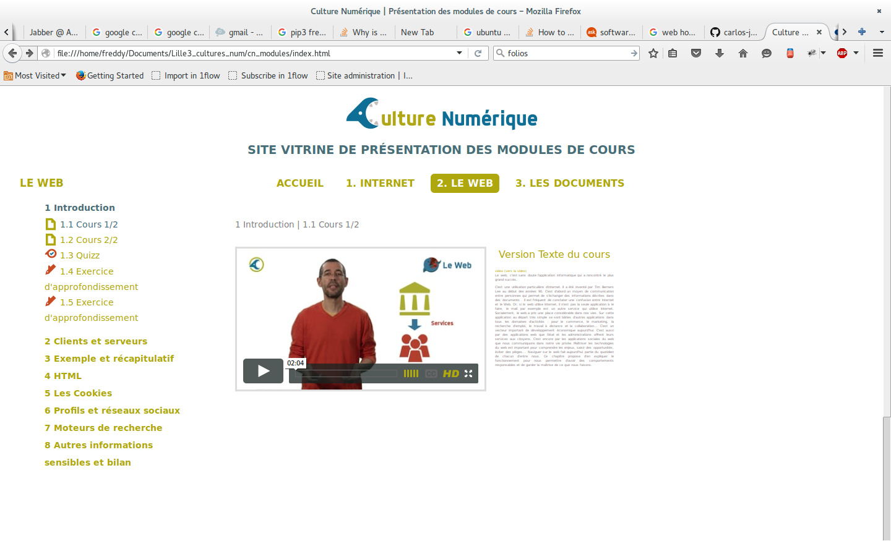
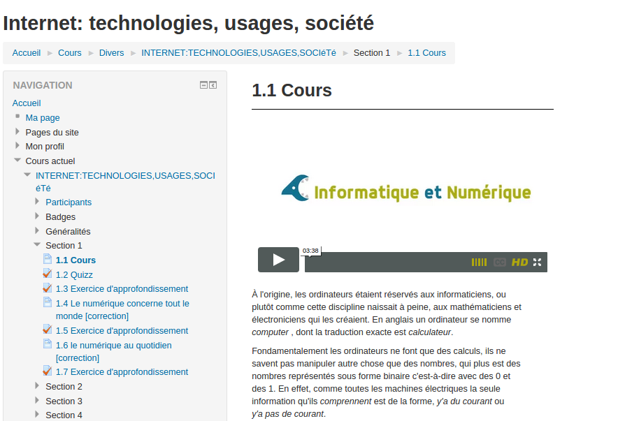

# Comment les éléments de cours "Culture Numérique" sont-ils produits ?
========================================================================

Nous détaillons ici la chaine éditoriale adoptée pour la production des modules mis à dispositions sur ce dépôt.  
Nous utilisons un fichier dit "maitre" comme matrice de base pour générer le cours. La syntaxe employée est basée sur le format MarkDown, que nous avons étendu pour nos besoins spécifiques. Ces ajouts consistent en des conventions décrites ci-dessous et l'usage d'extensions proposées par la [librairie Python de MarkDown](https://pythonhosted.org/Markdown/extensions). 

### Structure globale d'un cours Culture Numérique
Un cours se décompose en sections et sous-sections. Le niveau sous-sections constitue le niveau "pivot" de la structure d'un cours Culture NUmérique. Chaque sous-section peut être du type et de la forme suivante:  

1. élément de cours simple (texte + images)  
2. élément de cours incluant une ou plusieurs animations (vidéo) accompagnées à chaque fois par la version texte lisible en mode _zen_ 
1. auto-évaluation sous forme de quiz 
2. exercice d'approfondissement incluant un énoncé (texte riche) et un espace pour fournir une réponse sous forme de texte libre

### Sous-section de cours simple

Rédigée en MarkDown, c'est un type de sous-section simple consistant en du texte mis en forme et enrichi d'images. 
Par rapport au MArkdown simple, nous utilisons les fonctions supplémentaires décrites ci-après.

#### ajouter des classes CSS 

Avec des [Attribute list](https://pythonhosted.org/Markdown/extensions/attr_list.html): Pour permettre d'ajouter des classes CSS à une image ou à un bloc de texte, pour permettre une mise en page enrichie.
Un exemple pour ajouter un attribut en ligne à un lien:  
`[link](http://example.com){: class="foo bar" .titre title="Some title!" }`  
qui produit le HTML suivant:  
`<p><a href="http://example.com" class="foo bar titre" title="Some title!">link</a></p>`  

Notez que pour ajouter des classes on peut soit spécifier `.une_classe` ou `class='une_classe``

#### Commentaires invisibles
En utilisant simplement les commentaires HTML:
    
        <!-- On pourrait aussi mentionner les lol cats dans cette section non ? -->

Le commentaire suivant ne sera donc pas visible dans le rendu HTML final.
<!-- Il faudrait vraiment enrichir cette documentation de quelques Gifs animés -->        

### Sous-section de cours avec animations vidéo
Ces éléments de cours consistent en des sous-sections pouvant inclure 1 ou plusieurs vidéos d'animations. Ici il y a 2 étapes:  
- a) avant la réalisation des vidéos, on ajoute des blocs 'Idée animation' pour décrire ce que pourrait contenir l'animation qui sera intégrée par la suite
- b) une fois la vidéo réalisée, on intègre le lien de la vidéo qui sera ensuite intégrée via une iframe dans la sous-section de cours

####a) Notes pour idées d'animation
On utilise ici le principe natif de block quote Markdown avec un `>` en début de paragraphe:
```    
> [Animation] Peut être des lettres simples en suite de 0 et de 1, et des
compositions en mots/composition de suites de 0 et 1...  est-ce
qu'on fait passer l'idée de coder/décoder et sa contraction en codec?  
```
Qui produira ce résultat:

> [Animation] Peut être des lettres simples en suite de 0 et de 1, et des
compositions en mots/composition de suites de 0 et 1...  est-ce
qu'on fait passer l'idée de coder/décoder et sa contraction en codec?  

**NB** Si le mot clé `[Animation]` n'est pas inclu, le bloc sera toujours interprété comme bloc idée d'animation.

####b) Lien vers une vidéo d'animation
Sur le même principe que les *attribute lists* (cf ci-dessus), on spécifie qu'il s'agit d'un lien vers une vidéo en spécifiant la classe `lien_video`:  

    [Introduction au web](https://player.vimeo.com/video/138623497){: .lien_video } 

ou  

    [Introduction au web](https://player.vimeo.com/video/138623497){: class="lien_video" } 

Ce lien doit être placé à l'intérieur d'une sous-section. Une sous-section peut bien sûr comporter plusieurs vidéos. 

Ces liens vidéos font l'objet d'un traitement spécifique selon le type d'export:
* export Site Vitrine HTML: on génère un code d'iframe qui permet de lire le/les vidéo/s sans quitter la page courante; le texte de la sous-section est quant à lui offert en parallèle en mode "zen" activé au click sur la vignette à côté des vidéos (cf image ci-dessous).

* pour l'export Moodle/IMSCC, le lien est simplement reformaté pour respecter le format `http://vimeo.com/video_id` qui permet au plugin Viméo de Moodle de transformer le lien vidéo en iframe automatiquement:



### Sous-section Activités

Les activités peuvent être de 2 types:
- auto-évaluation: `activité`
- Exercices d'approfondissement: `activité-avancée`
Pour le découpage des activités, nous n'utilisons plus les `##` de la syntaxe markdown, mais les "fenced code blocks" en spécifiant le type d'activité  juste à côté des "backticks":

        ```activité
        ```

ou 

        ```activité-avancée
        ```

        
Ces activités sont rédigées en GIFT; chaque question est séparée par une ligne vide. Exemple:

        ```activité-avancée
        
        ::La représentation numérique d'un livre peut inclure des données qui ne se limitent pas au texte. Donnez quelques exemples:: {
        #### Le genre, la date de création, ...
        }
        
        ::Fonctionnalités d'un éditeur de textes::
        [html]<p>Parmi les  fonctionnalités suivantes, lesquelles sont possibles ?
        </p>
        {
        ~%25%copier/couper/coller#tous les éditeurs le permettent
        ~%25%rechercher et remplacer#très souvent disponible
        ~%25%avancer de mots en mots#souvent par la conjonction CRTL-flèches
        ~%25%corriger l'orthographe#certains le font
        ~%-100%mettre en gras#l'éditeur ne permet pas d'enregistrer des mises en forme (il est possible toutefois d'écrire des commandes de mise en forme : un mot n'est pas en gras mais un texte dans un langage peut exprimer l'ordre de mettre en gras)
        }
        ```


