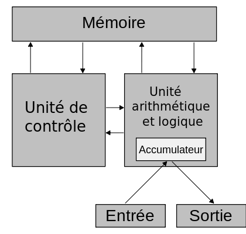
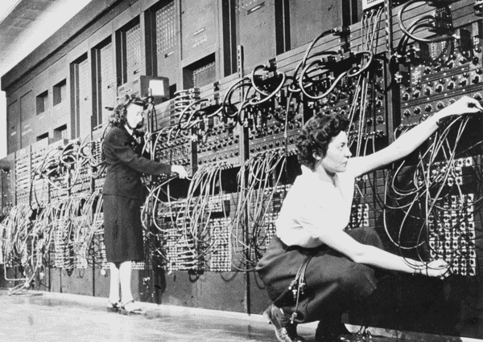
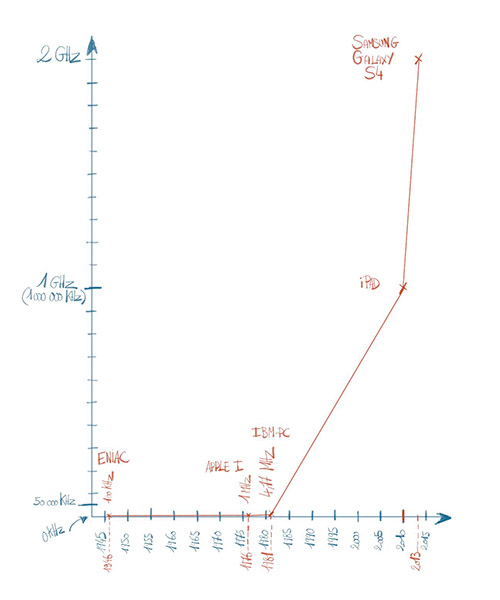
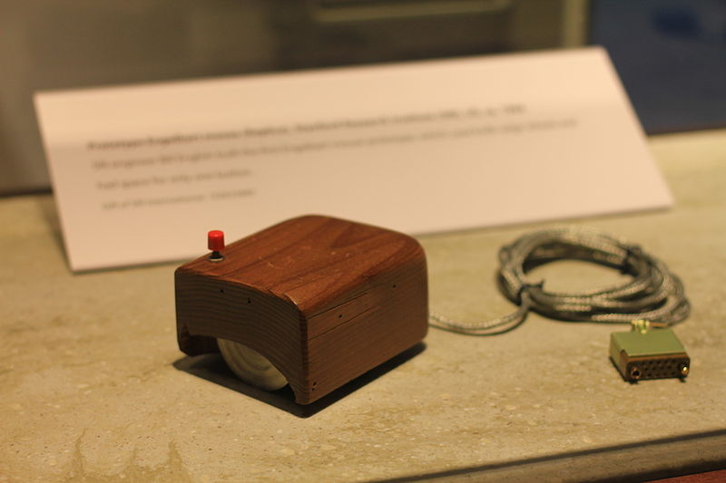
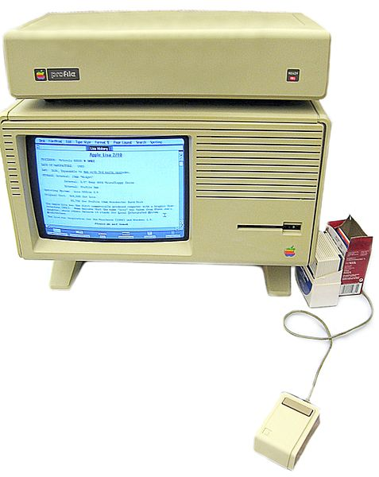
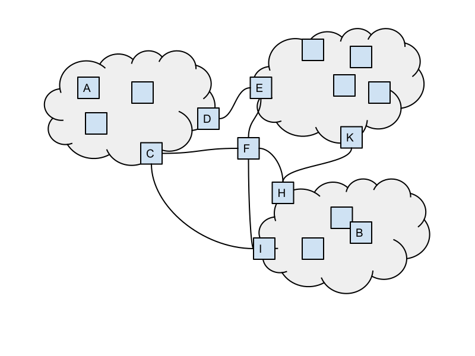

TITLE: Internet: technologies, usages, société
MENUTITLE: Internet
AUTHOR: Culture Numérique Squad
LANGUAGE: fr
CSS: http://culturenumerique.univ-lille.fr/css/base.css

# Informatique et numérique

[Informatique et numérique](https://vimeo.com/122104210){: .cours_video }

À l'origine, les ordinateurs étaient réservés aux informaticiens, ou
plutôt comme cette discipline naissait à peine, aux mathématiciens et
électroniciens qui les créaient. En anglais un ordinateur se nomme
*computer*, dont la traduction exacte est *calculateur*.

Fondamentalement les ordinateurs ne font que des calculs, ils ne
savent pas manipuler autre chose que des nombres, qui plus est des
nombres représentés sous forme binaire c'est-à-dire avec des 0 et
des 1. En effet, comme toutes les machines électriques la seule
information qu'ils "comprennent" est de la forme, "y'a du courant" ou
"y'a pas de courant".

Or, aujourd'hui, nous utilisons des ordinateurs tous les jours, non
pas pour faire des calculs, mais pour réaliser de nombreuses activités
diverses et variées qu'elles soient professionnelles, liées à nos
loisirs ou à notre vie quotidienne. Et pourtant, ces ordinateurs ne
sont toujours que des machines qui font des calculs. Il a donc fallu
trouver des techniques pour traduire/coder le texte, le son, les
images avec des nombres. C'est ce qu'on appelle la *numérisation*. On
dit souvent que notre monde est analogique (ou continu) et que le
monde des machines est numérique (ou digital). Les scanners, appareils
photo numériques, enregistreurs mp3 par exemple sont des dispositifs
qui permettent de passer du monde analogique des hommes au monde
numérique des machines, c'est-à-dire de numériser les informations
sous forme de nombres que les ordinateurs vont pouvoir manipuler.

Nous vivons dans un monde où le numérique a pris beaucoup de place :
internet, la radio, la télévision, la téléphonie, la photographie et
bien d'autres choses que nous ne soupçonnons pas sont entièrement
numériques et donc manipulables par des ordinateurs au sens large, par
exemple, des tablettes, des smartphones, les box adsl, ... en fait toutes
les machines qui fonctionnent avec des processeurs, (nous reviendrons
sur ce terme).

Cela représente des enjeux de société très importants. Le numérique a
ouvert des possibilités gigantesques en terme de gain de temps, de
facilité de traitement, de nouvelles fonctionnalités, d'accès aux
informations, aux archives, ... Mais en même temps de nouvelles
questions sont apparues : où sont stockées les données ? Qui y a accès ?
Sont-elles en sécurité ? Sommes-nous dépendants de machines, de
logiciels, de sociétés commerciales ?

Pour que ces questions ne restent pas dans les mains des
informaticiens, il est nécessaire que chacun fasse l'effort de
comprendre les bases, les fondements des technologies numériques qui
nous entourent. Le citoyen du XXIème siècle a besoin d'une véritable
culture numérique qui ne se limite pas à l'utilisation d'un traitement
de texte ou la participation à un réseau. C'est ce que nous allons
développer dans ces cours.

```comprehension
::Pourquoi représenter avec des nombres ?::
[html]<p>Pourquoi faut-il représenter les textes, images, sons,
etc, par des nombres dans un ordinateur ?</p>
{
~<p>C'est un choix industriel.</p>#<p>Non, les industriels n'avaient pas le choix.</p>
~<p>Les ordinateurs ont été inventés par des mathématiciens.</p>#<p>Non, les mathématiciens savent manipuler autre chose que des nombres, et les ordinateurs sont le fruit de l'interaction entre de nombreuses sciences.</p>
=<p>Tout ordinateur est fondamentalement une machine qui calcule avec des
nombres.</p>#<p>Oui, comme un ordinateur ne manipule que des nombres,
tout doit être représenté sous forme de nombres être manipulé par un ordinateur.</p>
####<p>Un ordinateur ne manipule que des nombres, tout doit donc être représenté sous forme de nombres pour qu'il puisse le manipuler.</p> }

::Numérisation::
[html]<p>Que signifie <em>numérisation</em> ?</p>{
=<p>L'opération qui consiste à représenter sous forme de nombres une
information quelle qu'elle soit.</p>#<p>Oui !</p>
~<p>L'opération qui consiste à citer tous les nombres (1, 2, 3, 4, ….).</p>#<p>Non, citer tous les nombres c'est compter...</p>
####<p>La numérisation est l'opération qui consiste à représenter sous forme de nombres une information, quelle qu'elle soit.</p> }

::Où sont les processeurs ?::
[html]<p>Parmi ces objets, quels sont ceux équipés de
processeur(s) \:</p>{ ~%20%<p>tablettes</p>
~%20%<p>smartphones</p> ~%20%<p>box ADSL</p>
~%20%<p>lecteur mp3</p> ~%20%<p>ordinateur</p>
~<p>aucun</p>#<p>Tous !</p> ####<p>Tous
ces objets sont équipés de micro-processeurs !</p> }
```

```activité
::Le numérique concerne tout le monde::
[markdown]
**Quels étudiants sont concernés par le numérique ?**
\n
Le numérique concerne évidemment les étudiants en informatique et plus généralement les étudiants des filières scientifiques.  Mais vous qui êtes inscrits dans une université de sciences humaines et sociales, êtes-vous concernés ?
\n
Choisissez au moins 3 des domaines suivants et faites des recherches pour voir en quoi ils sont impactés par le numérique : les médias, la santé, l'histoire, la sociologie, la linguistique, les arts, la culture, l'enseignement, l'archéologie.
\n
Faites une synthèse en quelques lignes de vos recherches en précisant les domaines auxquels vous vous êtes intéressés. Indiquez les liens des sites sur lesquels vous avez trouvé ces informations. La liste est non exhaustive et vous pouvez vous intéresser à d'autres domaines.
{####
# Le numérique concerne tout le monde
Ces recherches ont dû vous convaincre, si c'était nécessaire, que le numérique **n'est pas réservé** aux informaticiens, il concerne tout le monde, toutes les disciplines.
S'agissant plus particulièrement des **sciences humaines**, la prise en compte du numérique a fait évoluer les champs disciplinaires pour faire apparaître ce qu'on appelle les **humanités numériques** ( *digital humanities* en anglais).
\n
Voici quelques exemples que nous vous proposons, n'hésitez pas à proposer d'autres exemples dans le forum de discussion :
\n
* Dans les **médias** : nouveau sous-métier de journalisme : les **data-journalistes**
	* [data-visualisation](http://www.lemonde.fr/data-visualisation/)
	* [journalisme de données](http://fr.wikipedia.org/wiki/Journalisme_de_données)
* Dans la **santé** : (imagerie, dossier numérique du patient, ...)
	* [simulation](https://interstices.info/jcms/c_21525/simulation-de-loperation-de-la-cataracte)
* En **histoire, sociologie, linguistique** : *fouille de données*
	* [fouille de données](http://www.youtube.com/watch?feature=player_embedded&v=tp4y-_VoXdA)
* En **art et culture** :
	* [Le Fresnoy](http://www.lefresnoy.net/fr/Le-Fresnoy/presentation)
* Dans l'**enseignement** : (outils numérique d'accompagnement scolaire, MOOC,...):
	* [FUN](https://www.france-universite-numerique-mooc.fr/cours/)
* En fouille archéologique :  une réalisation prestigieuse réalisée à Lille :
	* [vase qui parle](http://bsa.biblio.univ-lille.fr/blog/2013/09/exposition-le-vase-qui-parle-au-palais-des-beaux-arts-de-lille/)
}
```

```activité-avancée
::Le numérique au quotidien::[markdown]Les microprocesseurs, les ordinateurs ont envahi notre quotidien. Pour chacun des domaines suivants, cherchez des exemples où le numérique a permis des évolutions notables :
\n
- Domotique
- Transports
- Vêtements
- Médical / paramédical
\n
Après avoir effectué vos recherches, copier dans la fenêtre de rendu 1 lien pour au moins 3 des 4 thèmes proposés (un lien par thème).
{####
# le numérique au quotidien
Quelques exemples que nous vous proposons au cas où vous n'auriez rien trouvé, ...
\n
La **domotique** est un domaine en pleine expansion qui vise à équiper numériquement notre maison :
\n
- [nest](https://nest.com/fr/)
- [domotique](http://fr.wikipedia.org/wiki/Domotique)
\n
Pour les **transports**, les ordinateurs de bord sont depuis longtemps présents dans les voitures, de plus en plus ils sont responsables de notre sécurité :
\n
- [electrostabilisateur]( http://fr.wikipedia.org/wiki/electrostabilisateur_programmé)
- [ordinateur de bord](http://fr.wikipedia.org/wiki/Ordinateur_de_bord)
\n
Les **chaussures** : gadget ou réelle innovation ? Ce genre d'objet est de plus en plus présents dans nos vies :
\n
 - [chaussures](http://www.linternaute.com/science/technologie/deja-demain/07/chaussure-intelligente/chaussure-intelligente.shtml)
Les **lentilles pour la vue** ?
 - [lentilles](http://www.zdnet.fr/actualites/google-apres-les-lunettes-connectees-les-lentilles-pour-le-diabete-39797148.htm)
}

::Le numérique dans la société::
[markdown]
**Le numérique, un enjeu pour les citoyens du XXIème siècle** ...
\n
Le numérique nous concerne tous en tant que citoyen. Il permet de nouvelles choses en automatisant des procédures et en donnant accès à des données jusqu'ici inexploitables. Mais numérique n'est évidemment pas systématiquement synonyme de progrès. Il faut toujours réfléchir aux **finalités des applications** développées. Nous vous invitons à vous documenter et à réfléchir aux questions suivantes :
\n
- Dans la **gestion de l‘énergie**: qu'est-ce que la troisième révolution industrielle et pourquoi le numérique y contribue-t-il ?
- En **politique et média** : Qu'est-ce que la vérification par les faits (fact-checking en anglais) ? En quoi le numérique l'a rendue possible / facile ?
- En **citoyenneté** : Que signifie vote électronique et en quoi cela pose-t-il des questions essentielles ? Trouver au moins un avantage et un inconvénient.
\n
Après avoir fait vos recherches, répondez aux questions posées en quelques lignes et en indiquant les liens où vous avez trouvé ces informations.
{####
Voici quelques liens que nous vous proposons mais que vous avez sûrement trouvés par vous-même :
\n
- À propos de la troisième révolution industrielle :
	- [Troisième révolution industrielle](http://fr.wikipedia.org/wiki/Troisième_révolution_industrielle)
	- [pasdecalais](http://www.latroisiemerevolutionindustrielleennordpasdecalais.fr)
- En politique et média : Qu'est-ce que la vérification par les faits (fact-checking en anglais) ? En quoi le numérique l'a rendue possible / facile ?
	- [vérification par les faits](http://fr.wikipedia.org/wiki/Vérification_par_les_faits)
- En citoyenneté : Que signifie vote électronique et en quoi cela pose-t-il des questions essentielles ? Trouver au moins un avantage et un inconvénient.
	- [arguments] (http://fr.wikipedia.org/wiki/Vote_électronique#Arguments_en_faveur)
}
```

# Historique informatique

[Historique](https://vimeo.com/122104231){: .cours_video }


Les premiers ordinateurs ont été conçus et réalisés vers la fin de la
seconde guerre mondiale. Il était déjà possible de leur faire réaliser
des calculs complexes inaccessibles à la main. Ils sont alors capables
de manipuler des informations représentées sous une forme
numérique. Grâce à la numérisation de textes, d'images, de sons, etc,
les ordinateurs sont devenus des machines de traitement automatique de
l'information. En français, le mot ordinateur s'est imposé en 1956.

Les premières machines sont réalisées avec des composants
rudimentaires comme des relais électriques et des lampes à vide. Elles
sont très volumineuses et lourdes, consomment énormément d'énergie. Mais surtout, leur utilisation est complexe car il est nécessaire
d'écrire les programmes qu'elles exécutent dans un langage très
technique propre à chacune d'elles : un langage machine. De ce fait,
leur diffusion et leur commercialisation sont très limitées. Deux
inventions majeures vont lever ces difficultés : les langages
informatiques et la miniaturisation.

C'est à la fin des années 50 que
les premiers langages informatiques de programmation apparaissent. Ce
sont des langages artificiels, c'est-à-dire inventés par l'homme,
facilement lisibles et intelligibles. Un programme spécifique appelé *compilateur* ou *interprète* se charge
de traduire un texte écrit dans ce langage de programmation en langage
machine. Les conséquences sont importantes : la programmation devient
accessible à un plus grand nombre d'individus, et l'écriture d'un
programme n'est plus spécifique à une machine. C'est le début du
métier de programmeur. Le changement d'ordinateur pour une autre version plus rapide ou plus
puissante est facilité et moins coûteux car les programmes ne doivent
pas être réécrits.

La deuxième évolution majeure, la miniaturisation, se déroule au début
des années 70. Elle est réalisée par l'intégration des transistors et
de tous les composants électroniques réalisant les calculs dans un
ordinateur, dans un seul petit boîtier appelé microprocesseur. C'est
Intel, entreprise fondée entre autres par Gordon Moore qui réalise
cette performance technologique. Aujourd'hui des boîtiers de quelques
millimètres peuvent contenir plusieurs milliards de transistors. La
miniaturisation permet l'augmentation des performances et la baisse de
la consommation d'énergie.

Gordon Moore est également connu pour avoir énoncé une prédiction sur
ce processus de miniaturisation. *Le nombre de transistors intégrés
dans les microprocesseurs doublera tous les 2 ans*. Cette affirmation
connue sous *la loi de Moore* se vérifie depuis plus de 40 ans. On
l'interprète dans le grand public comme *la puissance des ordinateurs
double tous les 2 ans*. Ce qui signifie en pratique que lorsque vous achetez un ordinateur,
moins de 2 ans après vous pouvez trouver un autre modèle 2 fois plus
puissant au même prix.

```Comprehension
::De quand datent les premiers ordinateurs::
[markdown]**De quand datent les premiers ordinateurs ?**
{
~Au XVIIe siècle
~Juste avant la Révolution française
=À la fin de la seconde guerre mondiale
~Dans les années 1980
~Avant la première guerre mondiale
####C'est à la fin de la seconde guerre mondiale que les premiers ordinateurs sont apparus.}

::La loi de Moore::
[markdown]**Que dit la loi de Moore ?**
{~Que s'il existe au moins deux façons de faire quelque chose et qu'au moins l'une de ces façons peut entraîner une catastrophe, il se trouvera forcément quelqu'un quelque part pour emprunter cette voie.#Non, ça c'est la loi de Murphy.
=Que la puissance d'un ordinateur double tous les 2 ans environ.#Exact !
####La puissance d'un ordinateur double environ tous les 2 ans.}
```

```Activité
::La puissance augmente::
[markdown]**Une histoire de puissance**
\n
Entre mon ordinateur et l'ordinateur de mon père qui ont 12 ans d'écart, quelle est la différence de puissance à laquelle on peut s'attendre ? Pensez à utiliser la loi de Moore et pensez à bien écrire la puissance après 2ans, 4 ans, 6 ans, ..., avant de répondre.
{
~Ils sont tous les deux aussi puissants, ça n'a pas changé en 12 ans.#Il faut revoir la vidéo !
~Mon ordinateur est environ 20 fois plus puissant.#Bien plus que ça...
=Mon ordinateur est environ 60 fois plus puissant#Tout à fait !
~Mon ordinateur est environ 150 fois plus puissant.#Quand même pas tant que ça !
####[markdown]Réponse:
\n
	- 2 ans : x 2
	- 4 ans : x 4
	- 6 ans : x 8
	- 8 ans : x16
	- 10 ans : x32
	- 12 ans : x64
\n
En d'autres mots un traitement qui prenait 30 min avec l'ordinateur de mon père s'effectue en 28 s sur le mien !
}


::Un bug::
[markdown]**D'où vient le mot "bug" ?**
\n
Il est malheureusement courant d'être confronté à des programmes <em>bugués</em>, c'est à dire des programmes qui ne font pas ce qu'ils sont sensés faire. Mais savez-vous d'où vient le terme *bug* ?
{
=En anglais, bug signifie insecte. Un insecte s'était glissé dans le mécanisme d'un des premiers ordinateurs, ce qui avait fait griller un relais et provoqué une panne.#En effet, il s'agissait d'une mite.
~Bug était le surnom d'un des premiers programmeurs chez Microsoft, il était réputé pour commettre beaucoup d'erreurs.#Non, cherchez bien, c'est sur le web !
~Bug est la version en verlan de GUB (Grande Unité Binaire), un projet d'ordinateur qui n'a jamais fonctionné.#Non, cherchez bien, c'est sur le web !
~Bug est le diminutif de Bugatti, la marque de la première voiture de luxe de Bill Gates, le fondateur de Microsoft. Cette voiture serait tombée 13 fois en panne en un an...#Non, cherchez bien, c'est sur le web !
~L'équipe des fondateurs d'Apple étaient des fans du dessin animé Bugs Bunny. Ils avaient pris l'habitude d'appeler Bugs leurs erreurs de programmation.#Non, cherchez bien, c'est sur le web !
####Le premier bug a été causé par [une mite](media/TheFirstBug_1947.jpg)
}
```

```activite-avancee
::Des personnages importants::
[markdown]
Tout ne s'est pas fait en un jour, ...
\n
Vous connaissez sans doute des personnages importants de l'activité économique liée à l'informatique. Mais de nombreux chercheurs et ingénieurs ont contribué au développement des idées et des machines. Nous vous proposons de faire une recherche sur 4 personnes, dont 2 femmes qui ont largement contribué, chacune à leur façon,  à l'essor de l'informatique :
\n
- [Ada Lovelace](http://fr.wikipedia.org/wiki/Ada_Lovelace)
- [Grace Hopper](http://fr.wikipedia.org/wiki/Grace_Hopper)
- [Alan Turing](http://fr.wikipedia.org/wiki/Alan_Turing)
- [John Von Neuman](http://fr.wikipedia.org/wiki/John_von_Neumann)
\n
Par ailleurs, l'un de ces personnages est étroitement lié à une machine : **ENIGMA**. Vous chercherez également ce qu'est cette machine et à quoi elle servait. Tous deux, l'homme et la machine, sont les héros du film *The imitation Game* sorti sur les écrans français en janvier 2015.
\n
Après avoir effectué vos recherches sur ces personnes et cette machine, rédigez une présentation en quelques lignes en les resituant chronologiquement.
{####
## Personnages importants
### Ada Lovelace

\n
*Ada Lovelace* est une **mathématicienne**, fille du poète Lord Byron qui travaille au milieu du **XIXeme** avec Charles **Babbage** sur un projet que nous pourrions qualifier de **premier ordinateur**.
\n
Ce projet n'aboutira finalement pas dans un succès commercial mais aura contribué à produire les **bases de l'informatique**.
Le rôle d'Ada Lovelace dans ce projet a été tel qu'elle a été depuis qualifiée de *première programmeuse*.
\n
### Alan Turing

\n
Dans les **années 1930**, les travaux du **mathématicien** *Alan Turing* sont déterminants pour définir d'abord ce qu'est une **machine programmable** universelle, et ensuite pour dessiner les frontières de ce qu'il est possible de calculer à l'aide d'une telle machine. Turing a également eu une action déterminante pendant la **seconde guerre mondiale**. Il conçoit des machines capables de **décrypter** les messages allemands codés par la machine **Enigma**. Ses découvertes permirent, selon plusieurs historiens, de raccourcir la capacité de résistance du régime nazi de deux ans.
\n
Si la vie de cet homme exceptionnel au destin tragique vous intéresse nous vous conseillons les deux liens suivants :
\n
- [Alan Turing 1](http://future.arte.tv/fr/alan-turing)
- [Alan Turing 2](http://videotheque.inria.fr/videotheque/doc/758)
\n
Vous y découvrirez entre autre une hypothèse sur l'origine du logo de la pomme croquée d'`Apple`.
### John Von Neumann 	

\n
Dans les **années 40**, **John Von Neumann** propose une **architecture** pour une machine programmable.
Par architecture, il faut entendre comme dans l'habitat, une description précise de son organisation qui permet d'expliquer son fonctionnement et la construire effectivement. Notre ordinateur moderne apparaît.
\n

\n
*Von Neumann Architecture*, schéma par Chris Martin, source sous licence CC-BY-SA 3.0
\n
Dans ce monde numérique qui évolue si vite, il est remarquable que **deux notions fondamentales**, à savoir ce qu'il est *possible de calculer* par machine programmable défini par Turing, et cette *architecture* de machine dite de Von Neumann soient toujours celles qui régissent le fonctionnement de nos ordinateurs d'aujourd'hui.
\n
### Grace Hopper
\n

\n
*Grace Murray Hopper au clavier de l'UNIVAC, vers 1960.*, Smithsonian Institution, Source, photo sous licence CC-BY 2.0.
\n
C'est à la **fin des années 50** que les premiers **langages** informatiques de programmation apparaissent. Ce sont des langages artificiels, c'est-à-dire inventés par l'homme, facilement lisibles et intelligibles. Un programme spécifique appelé *compilateur* ou *interprète* se charge de traduire un texte écrit dans ce langage de programmation en langage machine. Les conséquences sont importantes : la **programmation** devient accessible à un plus grand nombre d'individus, et l'écriture d'un programme n'est plus spécifique à une machine. C'est le début du **métier de programmeur**.
\n
Grace Hopper a inventé le **premier compilateur**. Elle est aussi à l'origine du langage `Cobol` qui a été énormément utilisé dans l'informatique de gestion. On la voit ici (photo ci-contre) au clavier de l'`UNIVAC`, vers 1960.
}

::La vitesse des ordinateurs::
Le **microprocesseur** qui réalise les calculs dans un ordinateur déclenche ses opérations à intervalles de temps régulier. C'est **l'horloge** qui a ce rôle de définir la cadence de travail du processeur et donc sa vitesse de calcul.  La fréquence d'horloge se mesure en kiloHertz (kHz, milliers de fois par seconde), en MégaHertz (Mhz, millions de fois par seconde) ou en GigaHertz (GHz, milliards de fois par seconde). Cela correspond au nombre maximal d'opérations élémentaires qu'un ordinateur peut effectuer **en une seconde**. Nous vous proposons de faire quelques recherches pour prendre conscience des *ordres de grandeur* et des évolutions sur les 70 dernières années.
\n
En vous aidant par exemple de [cette page](http://fr.wikipedia.org/wiki/Histoire_des_ordinateurs), retrouver la **date** d'apparition et la **fréquence** d'horloge (en khz, Mhz ou Ghz) de ces machines emblématiques de leur époque :
\n
- l'ENIAC
- Apple I
- IBM PC
- Ipad (premier modèle)
- smartphone Samsung Galaxy S4
\n
Essayez de tracer un diagramme ou une courbe pour représenter cette évolution. Quelle difficulté rencontrez-vous et que pouvez-vous en déduire sur cette évolution ?
{####
## la vitesse des ordinateurs
**La vitesse des ordinateurs**
\n
**L'ENIAC**
\n

\n
L'un des tout premiers ordinateurs, l'`ENIAC` a été réalisé en **1946**. Il avait une vitesse d'horloge de **100khz**, ce qui signifie qu'il était capable de faire **100 000 opérations élémentaires par seconde**. Ces opérations étaient par exemple des additions sur des nombres simples. Les actions complexes que l'`ENIAC` réalisait étaient *décomposées* en une multitude d'opérations élémentaires. C'est toujours le cas pour tous les programmes informatiques.
\n
Ces caractéristiques techniques peuvent nous paraître ridicules mais elles correspondent à calculer en **3s** ce que des mathématiciens sont capables de faire *à la main* en **3 jours**.
\n
###
En **1976**, sort l'`Apple I` avec une fréquence d'horloge de **1 Mhz** (1 Million d'opérations élémentaires par seconde). En trente ans, la puissance a été **multipliée par 10** alors que l'encombrement est passé de la taille d'une maison (30 tonnes, 170 m2) à celui d'une machine qui tient sur une table.
\n
L'`IBM-PC` quant à lui apparaît en **1981** et *tourne* à une vitesse de **4,77Mhz**. La vitesse a donc été multipliée par presque 5 en 5 ans.
\n
###
En **2010**, une des premières tablettes, l'`IPAD` est proposé sur le marché avec un processeur travaillant à 1Ghz, soit **1 milliards d'opérations élémentaires par seconde**. Notons que ces opérations élémentaires sont de plus en plus complexes, ce qui accentue encore l'augmentation de la puissance des machines. 1Ghz correspond à 200 fois 5Mhz, l'IPAD est donc plus de **200 fois plus puissant** que les premiers PC.
\n
###
En **2013**, le `Samsung Galaxy S4` est un *smartphone* qui tient dans la main et dans la poche et qui a une fréquence d'horloge supérieure à **2Ghz**. On pourrait ajouter que ces machines ont plusieurs processeurs qui travaillent ensemble ce qui démultiplie là encore leurs capacités,...
\n

\n
Comme nous l'avons précisé dans la question, la vitesse des processeurs n'est pas le seul élément à prendre en compte, mais il donne une bonne idée de l'évolution de la puissance des machines.
\n
Représenter cette évolution sur une courbe est particulièrement difficile, car la courbe croît tellement vite qu'elle *sort* très rapidement de la feuille. Multiplier par 2 à chaque intervalle de temps régulier définit une courbe **exponentielle**, caractéristique de la *loi de Moore* qui prédit cette évolution. Peu de technologies ont des évolutions aussi spectaculaires.
\n
Notons, que cette loi *empirique* (constatée, mais pas démontrée) s'arrêtera forcément un jour, la vitesse ne pouvant être infinie. Beaucoup de gens ont d'ailleurs prédit qu'à telle ou telle date, la loi ne se vérifierait plus, ... or, pour l'instant elle tient toujours, ...
}

::D'où vient le PC ?::
[markdown]
**L'Ordinateur personnel**
\n

\n
Historiquement, les premiers ordinateurs étaient de très grosses machines (appelés *MainFrame* en anglais) occupant des salles entières et dédiés à des traitements de gestion. La miniaturisation a entraîné l'apparition d'ordinateurs pouvant être posés sur des bureaux. C'est la naissance de la *deuxième ère de l'informatique*.
\n
C'est au début des années 70,  qu'un français, *François Gernelle* (photo),  a breveté l'idée d'**ordinateur personnel**. Mais c'est au début des années 80, qu'une grande entreprise américaine du secteur informatique, `IBM` commence une production massive d'un autre modèle d'ordinateur personnel qui lui assure un succès commercial important qui va marquer le secteur pendant des années. Depuis, on dit souvent que le premier ordinateur personnel a été celui fabriqué par `IBM`, ordinateur appelé *PC* pour *Personnal Computer*.
\n
Faites des recherches sur l'`IBM - PC` pour répondre aux questions suivantes :
\n
- En quelle année est-il apparu ?
- Quelle quantité en a-t-on fabriqué ?
- Quelle était la capacité de son disque dur ?
- Pourquoi le `PC` d'`IBM` est-il resté dans l'histoire ?
{####
## D'où vient le PC ?
### Le PC de 1981 à aujourd'hui
\n
L'`IBM-PC` a fait son apparition en **1981**. Plusieurs millions d'exemplaires ont été vendu à travers la monde. Le premier modèle ne possédait **pas de disque dur**, seulement des lecteurs de disquettes. Par la suite, d'autres modèles toujours plus puissants et sophistiqués ont vu le jour. À chaque fois les nouveaux modèles étaient compatibles avec les anciens, cela signifie que les programmes qui fonctionnaient sur les anciens modèles pouvaient être réutilisés avec les nouveaux.
\n
`IBM` s'est associé avec `Microsoft` qui fournissait le système d'exploitation qui s'appelait alors `MS-DOS`. Celui-ci a évolué en même temps que les capacité des machines. La dernière génération connue s'appelle ... `Windows 10` !
\n
Grâce à son **architecture ouverte** (i.e. la "description des schémas de fonctionnement" a été diffusée), de nombreuses autres marques ont fabriqué des machines comparables en respectant des **normes** et en installant également les systèmes de `Microsoft`. On les a appelé des **compatibles PC**. Aujourd'hui, on a l'habitude de parler de `PC` et `IBM` n'a plus qu'une très petite part de ce marché. En revanche `Microsoft` reste hégémonique pour le système d'exploitation `Windows`.
\n
Il faut néanmoins savoir que d'autres systèmes peuvent être installés sur les `PC`, en particulier `Linux`, qui est un système d'exploitation **rapide**, **fiable** et **puissant** qui est par certains aspects bien meilleur que `Windows`. Malheureusement, les accords commerciaux entre les constructeurs de machines et `Microsoft` rendent assez compliqués l'achat d'un `PC` équipé de `Linux`. En pratique, un PC équipé de `Linux` à la place de `Windows` est quasi introuvable dans le commerce grand public.
\n
Pour l'anecdote, le texte que vous êtes en train de lire a été rédigé sur un PC sous `Linux`.
\n
### Qui l'eut cru ?
\n
En **1984** sort la troisième génération de PC : le `PC/AT`
\n
Extrait de wikipedia : [http://fr.wikipedia.org/wiki/IBM_PC](http://fr.wikipedia.org/wiki/IBM_PC)
\n
*La machine fut jugée suffisamment puissante — selon les critères de l'époque — pour être interdite à l'exportation vers les pays de l'Est, alors sous embargo technologique (COCOM). IBM en refusa aussi pendant deux ans la vente à prix réduit au personnel, arguant qu'un particulier ne pouvait pas avoir besoin d'une telle puissance ni d'une telle capacité disque (30 Mo), qui la destinaient plutôt aux petites et moyennes entreprises.*
}

::Les interfaces Homme - Machine::
Une branche de la science informatique est l'étude des interactions entre l'homme et la machine. De ce point de vue, de nombreuses avancées ont été réalisées depuis 1945. Elles sont liées à  la fois, à des progrès technologiques, à des efforts d'ingénieurs et à des succès commerciaux, mais aussi à des avancées dans les idées. Nous vous proposons de faire quelques recherches pour appréhender l'évolution des interfaces.
\n
- Que doit-on à Douglas **Engelbart** ?
- Qu'est-ce que le  **Palo Alto Research Center** ? Qu'y fait-on ?
- Qu'est-ce que l'ordinateur **Lisa** ? Qu'a-t-il apporté de nouveau ? Qui l'a fabriqué ? En quelle année est-il apparu ?
\n
Par ailleurs, les ordinateurs prennent désormais des formes nouvelles et se combinent avec d'autres objets du quotidien. Effectuez des recherches pour dire ce qu'on appelle l'informatique ubiquitaire (ou informatique omniprésente) et donnez un meilleur représentant.
{####
## Évolution des interfaces homme-machine
### Les interfaces ont démocratisé l'accès au numérique
\n
Une branche de la **science informatique** est l'étude des interactions entre l'homme et la machine.
\n
De ce point de vue, de nombreuses avancées ont été réalisées depuis 1945. Elles sont liées à  la fois à des progrès technologiques, des efforts d'ingénieurs et des succès commerciaux, mais aussi des avancées dans les idées.
\n
**Douglas Engelbart** par exemple,  était un grand spécialiste des interfaces homme-machine. Il a créé le premier **prototype de souris** (ci-contre) en **1968**. Il avait imaginé également les interfaces graphiques qui apparaîtront plus tard. En attendant, les écrans n'affichaient que du texte, ligne par ligne et les commandes étaient entrées avec un clavier. Les **cartes perforées** étaient également très utilisées pour ne pas avoir à re-saisir les programmes à chaque utilisation.
\n

\n
*Le premier prototype de souris, développé par Douglas Engelbart*. Photo par Michael Hicks, source sous licence CC-BY 2.0.
\n
[Pour en savoir plus sur Doug Engelbart.](http://www.silicon.fr/in-memoriam-doug-engelbart-pere-de-la-souris-87561.html)
\n
C'est également au **P.A.R.C**. qu'est apparue la notion d'informatique **ubiquitaire** qui est considérée comme la **troisième ère de l'informatique**. La première étant celle des *gros systèmes* (MainFrame), la deuxième apparue dans les années 80, celle des *ordinateurs personnels* (PC et Mac). L'emblème de cette informatique ubiquitaire est le **smartphone**, un ordinateur très puissant qui ne nous quitte presque plus, et qui nous permet d'être connecté en permanence.
\n
On parle aussi, d'informatique *omniprésente* ou *d'intelligence ambiante.*
\n
Les **objets connectés**, de plus en plus présents, participent également à cette évolution. Cette omniprésence de l'accès à l'information a un fort impact sur la société, modifie les habitudes de travail et de vie privée.
\n

\n
*Le Lisa*, photo par Marcin Wichary, source sous licence CC-BY 2.0.
\n
En **1983**, Apple achète pour 40 000$, une licence pour le brevet de la souris, et sort le premier ordinateur personnel équipé d'une souris et d'une interface graphique : le **Lisa**. Il va révolutionner le marché des ordinateurs personnels qui débutait (2 ans après le premier PC). Parmi les concepteurs du Lisa, on retrouvera **Steve Jobs**, un autre visionnaire qui fera la carrière qu'on connaît chez `Apple`.
}
```


# Naissance d'internet

[Naissance d'internet](https://vimeo.com/122104260){: .cours_video }

Dans les années soixante, il existait aux États-Unis de gros centres
de calcul abritant de très gros ordinateurs. Ceux-ci étaient reliés
entre eux par des câbles qui leur permettaient de transporter
l'information numérique : des réseaux informatiques (network en
anglais souvent abrégé en net).

En période de guerre froide, les États-Unis avaient peur de voir leurs centres
bombardés ou une ligne qui reliait 2 centres coupée. Il fallait
pouvoir communiquer entre des centres stratégiques et pouvoir
bénéficier à distance des résultats des supercalculateurs même en cas
d'attaque nucléaire. Ils ont demandé aux chercheurs de proposer un
système qui serait tolérant aux pannes ou aux bombes!

L'idée a été de multiplier les centres et d'interconnecter les réseaux
de chaque centre. Pour protéger l'ensemble, la proposition a été de
multiplier les chemins entre centres. Ainsi si un centre explosait ou
qu'une ligne était coupée, les autres centres pourraient encore
communiquer entre eux en passant par d'autres chemins : ce fut la
naissance d'ARPANET (1971).

Ce système a tout de suite rencontré un grand succès. Il a ensuite
évolué vers INTERNET, nom qu'on lui a donné au début des années 80
pour signifier qu'il s'agit d'une interconnexion de réseaux.

Selon le vieil adage *tous les chemins mènent à Rome*, le système de
communication permet d'échanger des données entre 2 points en passant
par n'importe quel chemin à l'intérieur d'internet.


```comprehension
::signification d'internet::
[markdown]**Que signifie internet ?**
{
~Il s'agit de la contraction des mots anglais : *international* et *network* (réseau international).#Ça aurait pu, mais non !
=Il s'agit de la contraction des mots *interconnection* et *networks* (interconnexion de réseaux).#Exactement !
~Les lettres du mot I.N.T.E.R.N.E.T sont les initiales des noms de ses 8 fondateurs.#Pas du tout !
####Internet est la contraction des deux mots anglais "interconnection" et "networks", qui signifie "interconnexion de réseaux".}


::Âge d'internet::
[markdown]**Quelle est la date la plus proche de la création d'internet ?**
{
~1789#Vraiment ?
~1918#N'est-ce pas un peu tôt ?
~1945#N'est-ce pas un peu tôt ?
=1970#Oui, c'est cela.
~1990#Non, c'est trop récent...
~2005#Aussi tard ?
####C'est aux environs de 1970 qu'a été créé internet.}


::Robustesse d'internet::
[markdown]**Pourquoi internet est-il qualifié de réseau robuste ou tolérant aux pannes ?**
{
~Parce qu'il est fabriqué avec des matériaux très résistants.#Et non, ce n'est pas uniforme...
~Parce que beaucoup de salariés sont à sa disposition pour le réparer rapidement si nécessaire.#Vous êtes sûr ?
=Parce que, de par sa conception, il peut fonctionner en mode *dégradé*, c'est à dire que même si des lignes ou des machines sont en panne, d'autres chemins peuvent être utilisés pour véhiculer les
informations.#Tout à fait !
####Parce qu'il peut fonctionner en mode "dégradé"... }
```

```activité-avancée
::Qui a inventé internet ?::
On a parfois une représentation erronée du rôle des différents pays dans la **création** d'internet. Faites des recherches sur les deux personnes suivantes pour rétablir un juste équilibre.
\n
- Qui est Vinton « Vint » Gray Cerf ? Comment est-il parfois surnommé ?
- Qui est Louis Pouzin ? Qu'était le projet Cyclades ?
\n
Après vous être documenté sur ces deux personnages importants, rédigez une courte réponse qui résume ce que vous avez appris.
{####
## Qui a inventé internet ?
### Vinton Gray Cerf
\n

\n
*Dr. Vint Cerf*, photo de Veni Markovski, source sous licence CC-BY 3.0.
\n
*Extrait de Wikipédia*
\n
>Vinton « Vint » Gray Cerf, né le 23 juin 1943 à New Haven, Connecticut, États-Unis, est un ingénieur américain, chercheur et co-inventeur avec Bob Kahn du protocole TCP/IP. Il est considéré comme l'un des pères fondateurs d'internet.
\n
Il est souvent appelé le *père d'internet*.
\n
### Louis Pouzin
\n

\n
*Louis Pouzin*, Photo de Jérémie Bernard, source sous licence CC-BY-SA 3.0.
\n
*Extrait de Wikipedia*
\n
>Cyclades était un projet expérimental français ayant pour but de créer un réseau global de télécommunication utilisant la commutation de paquets. Créé en 1971, conçu par Louis Pouzin, il fut abandonné en 1978. Ses concepts ont influencé les travaux de développement d'internet en inspirant sa suite de protocoles.
\n
Si vous voulez écouter son **avis** sur ce qu'est devenu internet, voici une vidéo très intéressante :
[Louis Pouzin Youtube](https://youtu.be/p70Go9IS1h4)
}

::Qui a accès à internet ?::
Effectuez des recherches pour répondre aux questions qui suivent. Vous pouvez commencer vos recherches à partir de  [cette page sur l'histoire](http://fr.wikipedia.org/wiki/Histoire_d'Internet) et [cette page qui donne des statistiques d'utilisation](http://www.blogdumoderateur.com/chiffres-internet/)
\n
- Combien y avait-il dans le monde d'ordinateurs connectés en 1984 ? En 1987 ? En 1989 ? Aujourd'hui ?
- en quelle année a-t-on passé la barre du million d'utilisateurs ?
- Quelle proportion de la population mondiale n'a pas accès à internet ?
- À l'inverse, quelle proportion a accès à internet en France ? Est-ce supérieur ou inférieur à la moyenne européenne ? Est-ce supérieur ou inférieur à la moyenne aux USA ?
- En 1 minute, dans le monde, combien de recherche Google ? Combien de mails sont envoyés ? Combien de contenus sont partagés sur Facebook ?
{####
## Qui a accès à internet ?
\n
L'accès à internet a considérablement évolué en quelques années. Néanmoins, de grandes **inégalités** persistent encore.
\n
Le nombre d'ordinateurs connectés permet de faire une approximation du nombre de personnes qui utilisent internet.
Il y avait **1000 machines connectées en 1984**, 3 ans plus tard 10 fois plus, c'est à dire **10 000 en 1987**. Cela a encore été multiplié par 10 dans les 2 années qui suivirent, soit **100 000 machines en 1989**. Puis le **million** d'utilisateurs a été franchi en **1992**.
22 ans plus tard, nous en sommes à presque **3 milliards d'utilisateurs** à travers le monde. Il n'existe certainement rien d'autre à travers l'histoire qui ait connu une telle évolution !
Et pourtant, la population mondiale est supérieure à 7 milliards, ce qui nous permet de nous rendre compte que **plus de la moitié de la population mondiale** n'a toujours **pas accès** à internet !
En **France** en 2014, **83%** de la population est connectée, un taux supérieur à la moyenne européenne et supérieur aussi à celui des États-Unis.
\n
Enfin, pour tenter de mesurer l'ampleur des informations échangées sur internet, regardons ce qui ce passe en moyenne chaque minute :
\n
- 4 millions de recherches Google
- 200 millions de mails envoyés
- 2,46 millions de contenus partagés sur Facebook
}
```

# Comment ça marche?

[Comment ça marche ?](https://vimeo.com/122104315){: .cours_video }

Regardons un peu plus précisément comment fonctionne internet. Trois
ingrédients importants interviennent dans le système.

Le premier est l'*adresse `IP`* qui permet de fournir un nom et une adresse à chaque machine.  Chaque ordinateur connecté à internet a un numéro unique (un peu comme un numéro de téléphone, mais bien plus long !). Ce numéro
dépend de l'endroit où l'ordinateur se trouve dans internet et permet
donc de trouver un chemin dans l'interconnexion de réseaux. On appelle
ce numéro l'adresse `IP`. De façon très simplifiée, l'adresse `IP`
comporte une partie identifiant un réseau dans cette interconnexion et
une autre partie identifiant la machine au sein de ce réseau.
Pour échanger des informations d'un ordinateur vers un autre, celui
qui *envoie* l'information doit donc connaître l'adresse `IP` du
destinataire, et pour obtenir une réponse, l'émetteur doit
impérativement fournir dans chaque message envoyé sa propre adresse
`IP`. Tous les messages échangés sur internet sont donc de la forme :
`n°IP destinataire / information / n°IP émetteur`.

Le deuxième ingrédient concerne le *routage des messages* sur le
réseau.  Si les ordinateurs émetteur et destinataire sont dans le même
réseau, le principe est simple : l'ordinateur émetteur envoie son
message sur ce réseau et chaque ordinateur du réseau le lit. Les
destinataires peuvent alors s'intéresser aux messages qui leurs sont
destinés.  Si le destinataire n'est pas dans le même réseau, la
transmission ne peut plus se faire directement à l'ordinateur du
destinataire. L'émetteur envoie le message à une machine connectée à
la fois à ce réseau et à un ou plusieurs autres réseaux. Cette machine
est une passerelle/routeur qui réalise effectivement
l'interconnexion. Le routeur renvoie alors le message vers les autres
réseaux pour poursuivre son chemin. Et ce processus se répète jusqu'à
ce que le message arrive à destination.


Enfin le troisième ingrédient concerne le *nommage des machines*.  En
effet, ce sont des femmes et des hommes qui utilisent ces
machines. Pour désigner un destinataire, personne ne manipule
directement des adresses `IP` qui sont des numéros bien plus longs que
les numéros de téléphone. Dans notre interface avec le monde
d'internet nous connaissons plutôt des noms comme `www.univ-lille.fr`
ou encore `www.service-public.fr`. Le lien entre adresses `IP` et noms
se fait par le biais des *serveurs de noms* qui, à la manière d'une
liste de contacts dans notre téléphone, stockent un ensemble de noms et
d'adresses `IP`.

Très concrètement, regardons par exemple ce qui se passe lorsque je
veux consulter la page d'accueil de l'université de Lille.  Tout d'abord, je clique
sur un lien vers le site de l'université. Ce lien contient le nom de
la machine capable de me fournir la page d'accueil :
`www.univ-lille.fr`. Mon ordinateur va donc contacter un serveur de
noms pour connaître l'adresse `IP` de cette machine. Une fois que
cette adresse `IP` est connue, il peut communiquer avec
`www.univ-lille.fr` et envoyer à cette machine un message qui demande
le contenu de cette page d'accueil. Le message contient bien entendu
l'adresse `IP` de mon ordinateur, ainsi la machine peut me répondre en
renvoyant le contenu qui m'intéresse. Il ne reste plus alors à mon
ordinateur qu'à afficher ce contenu.

```Comprehension
::À quoi sert une adresse IP::
[markdown]**À quoi sert une adresse IP ?**
{
=À identifier les machines connectées de façon unique.#Oui !
~À différencier les gros ordinateurs et les plus petits.#Comment ça ?
~À envoyer des mails automatiquement.#Pas du tout...
####Une adresse IP (Internet Protocol) sert à identifier de façon unique les machines connectées.
}


::Équipement d'interconnexion::
[markdown]**À l'aide de quel équipement réalise-t-on l'interconnexion de réseaux ?**
{
~Une adresse IP#Vous devriez revoir la vidéo !
~Un serveur de noms#Non, il ne s'agit d'un serveur de noms.
=Un routeur#Exact !
####C'est à l'aide d'un routeur, ou une passerelle qu'on réalise l'interconnexion de réseaux.
}


::Qu'est-ce qu'un serveur de noms ?::
[markdown]**Qu'est-ce qu'un serveur de noms ?**
{
~Un site web qui aide à choisir un prénom pour ses enfants.#C'est une blague !
~Un logiciel (pirate) qui permet de trouver les mots de passe d'autres utilisateurs.#Pas vraiment...
=Une machine qui contient une table d'équivalence entre des noms de machines et leur adresse IP.#Oui, c'est exact !
####Un serveur de noms est une machine qui contient une table d'équivalence entre des noms de machines et leur adresse IP.
}
```

```activité
::Combien y-a-t-il d'adresses IP ?::
[markdown]
**Plus assez d'adresses IP ?**
\n
Les fondateurs d'internet n'envisageaient sûrement pas le succès phénoménal qu'il a rencontré. Aussi, le système de numérotation des adresses `IP` n'a pas été prévu suffisamment large pour répondre au nombre d'utilisateurs grandissant. Nous sommes depuis quelques années arrivés à un stade de **pénurie d'adresses IP**. La norme a donc dû évoluer. Aujourd'hui, deux normes cohabitent en attendant que tous les anciens systèmes s'adaptent à la nouvelle. Ces deux normes portent les noms de `IPV4` et `IPV6`. Faites des recherches sur ces normes pour répondre aux 2 questions suivantes :
\n
- Dans la norme IP version 4 `IPV4`, un numéro est composé de 4 nombres entre 0 et 255. Avec cette norme, y a-t-il plus de numéro IP possibles que d'êtres humains sur terre ?
- Nouvelle norme IP version 6 `IPV6`. Combien pourrait-on avoir de numéros IPV6 différents par millimètre carré de la surface de la terre ?
{####
## Combien y-a-t-il d'adresses IP ?
### `IP V4` : nombre d'adresses *vs* nombre d'êtres humains
\n
La population mondiale est supérieure à 7 milliards, or le système `IPV4` ne peut représenter que 4 milliards (4 294 967 296 = (2^^32^ )) d'adresses, ce qui est largement insuffisant.
L'apparition entre autre des *objets connectés* et des appareils mobiles fait exploser la demande et on entrevoit que cette demande va considérablement augmenter dans un avenir proche.
\n
### `IP V6`, on voit les choses en grand
v
Heureusement, la nouvelle norme `IPV6` est quand à elle beaucoup plus généreuse :
\n
*Extrait wikipedia* : [http://fr.wikipedia.org/wiki/IPv6](http://fr.wikipedia.org/wiki/IPv6)
\n
`l'augmentation de 2^^32 (soit environ 4,3×109) à 2128 (soit environ 3,4×1038) du nombre d'adresses disponibles.
Pour épuiser la totalité de ce stock d'adresses, il faudrait placer 667 millions de milliards d'appareils connectés sur chaque millimètre carré de la surface de la Terre`
Cette fois on peut espérer tenir avec ce système un bon moment.
\n
### Le numérique compte en binaire :
\n
Nous n'avons pas encore vu comment on code les informations en binaire. Pour tous ceux d'entre vous qui n'ont pas de culture scientifique, cela peut paraître abstrait. On peut quand même remarquer que les résultats ci-dessus s'expliquent en calculant de la façon suivante :
\n
- `IPV4` utilise des adresses codées sur 32 bits, le nombre de combinaisons est alors 2^32.
- `IPV6` code les adresses sur 128 bits, ce qui fait 2^128 adresses possibles.
}

::Les serveurs de noms::
[markdown]
**Les serveurs de noms : un maillon fragile de l'édifice**
\n
La norme qui régit le fonctionnement des serveurs de noms propose une organisation pyramidale des machines. Les machines au sommet de cette pyramide sont les **serveurs racine de DNS** ( DNS pour Domain Name System, en français, on parle de système de nom de domaine).
\n
À partir de [cette ressource](http://fr.wikipedia.org/wiki/Serveur_racine_du_DNS), faites les recherches nécessaires pour répondre aux questions suivantes :
\n
- Si ces machines s'arrêtaient, la traduction des adresses `IP` en nom et vice-versa s'arrêterait. Quel serait, à votre avis, l'impact de cet arrêt ?
- Combien existe-t-il de serveurs racine de DNS ?
- Qui possède ces machines : des états, des organisations, des sociétés privées ?
- Où se trouvent-elles majoritairement ?
- Que s'est-il passé en 2002 et 2007 ?
{####
## Les serveurs de noms [correction]
### Les serveur racines de DNS
\n
Si les serveurs racines de DNS **s'arrêtaient**, alors progressivement les millions de serveurs de noms répartis sur la planète qui en dépendent deviendraient obsolètes et la **correspondance** entre les noms des machines, que nous utilisons et les adresses IP **ne fonctionnerait plus**. En d'autres termes **internet s'arrêterait**.
Or, il n'existe que **13** serveurs racines, ils sont détenus (sécurisés et entretenus) par des **états**, des sociétés **commerciales** **privées** ou des **organisations**. Les machines qui hébergent ces serveurs sont majoritairement situées sur le **sol américain** et donc soumis au **droit américain**, alors que l'ensemble de la planète en dépend.
Beaucoup de gens pensent que cela constitue un problème, un bien commun universel aux mains de quelques-uns, soumis aux lois d'un seul pays, peut-on, doit-on faire confiance à des sociétés privées pour prendre les décisions qui concernent la gestion, la sécurité et le bon fonctionnement d'éléments aussi cruciaux que les serveurs racines de DNS. Certains militent pour une vision plus démocratique avec des décisions partagées.
\n
Vous êtes maintenant en capacité de comprendre ces questions pour vous forger votre propre opinion.
Ces serveurs racines sont des points faible du système, si l'un d'entre eux devient indisponible, alors c'est un 13ème de la charge qui qui doit être réparti sur les douze autres. Vu le nombre gigantesque de requêtes effectuées en permanence, cela peut ralentir l'ensemble du réseau à l'échelle de la planète.
C'est ce qui s'est passé en **2002** et en **2007**, lorsque des serveurs racines ont été la cible de **cyber attaques**.
*cf* [http://fr.wikipedia.org/wiki/Serveur_racine_du_DNS#Attaque_de_2002](http://fr.wikipedia.org/wiki/Serveur_racine_du_DNS#Attaque_de_2002).
}

::Panne générale::
[markdown]
**Panne générale**
\n
Dans le petit schéma ci-dessous, un nuage représente un réseau local. Les petits carrés sont des routeurs ou des ordinateurs.
\n

\n
Supposons que les communications dans chaque réseau local fonctionnent correctement, c'est-à-dire que chaque ordinateur d'un réseau local peut communiquer avec n'importe quel ordinateur du même réseau local. L'ordinateur A doit échanger des données avec l'ordinateur B.
\n
- Indiquer le groupe minimal de routeurs qui devraient tomber en panne pour empêcher la communication entre A et B ?
- Dans le cas des câbles, quel ensemble minimal de câbles devraient être coupés pour empêcher la communication entre A et B ?
- Lister tous les chemins possibles (sans boucle) qui permettent de relier A à B.
{####
Correction
\n
- Si les routeurs C et D tombent en panne le réseau local de A est déconnecté et A ne peut plus communiquer avec B.
- La même chose se produit si les routeurs H et I tombent en panne.
- Si F et I tombent en panne, alors les communications passent encore par D, E, K et H.
- Les câbles entre C-F, C-I, D-E, de la même façon isolent le réseau de A.
\n
A-C-I-B ; A-C-F-I-B ; A-C-F-H-B ; A-C-F-E-K-H-B ; A-D-E-K-H-B ; A-D-E-F-H-B ; A-D-E-F-I-B
}
```

# Que se passe-t-il quand on se connecte à internet?

## Cours
  [Se connecter à internet]( https://vimeo.com/122104376 ){:.cours_video}

Examinons les conséquences de l'organisation d'internet lorsqu'on veut
s'y connecter ...

### Rejoindre un réseau local
L'ordinateur, le smartphone ou la tablette qui doit accéder à internet
doit d'abord rejoindre un réseau. Nous verrons un peu plus loin les
différents moyens de se connecter à un réseau que ce soit par le wifi,
un câble ou le réseau de téléphonie mobile.

### Obtenir les 3 informations nécessaires
De plus, nous avons vu que pour communiquer avec d'autres machines,
notre ordinateur a besoin de trois informations importantes : le
numéro `IP`, l'adresse du routeur qui relie ce réseau à internet, et
l'adresse du serveur de noms. Ces trois informations sont fournies à
notre machine immédiatement après qu'elle ait rejoint le réseau. C'est
une machine particulière dans le réseau local qui fournit ces
informations et donc une autorité locale qui décide de ces
attributions. Par exemple chez vous, c'est votre box ADSL sous votre
responsabilité qui s'en charge. La box elle-même, qui est un
ordinateur presque comme les autres, reçoit ces 3 informations de
votre fournisseur d'accès à internet (FAI) quand elle démarre. Avec la
4G c'est une machine chez votre opérateur mobile qui est sollicitée…

### Pas de garantie de confidentialité
Autre remarque importante, le principe d'internet repose sur un envoi
de proche en proche des messages transmis entre émetteur et
destinataire à travers les ordinateurs (routeurs) qui réalisent
l'interconnexion. Dans ce mode de fonctionnement, il n'y a de garantie
ni de la confidentialité ni de l'intégrité des messages. Chaque
ordinateur participant à la transmission peut lire et modifier les
données échangées. Si l'on veut transmettre des données sensibles, il
faut donc mettre en œuvre des procédures spécifiques additionnelles
pour assurer l'authenticité et/ou la confidentialité des données
transmises. Par exemple, pour transmettre des mots de passe ou des
numéros de carte bleue, il est nécessaire de crypter les messages pour
les rendre indéchiffrables par des curieux.

### Filtrage et suivi possible
Une autre conséquence du fonctionnement d'internet, est que des
filtres peuvent être mis en place sur des routeurs pour empêcher
certains messages d'être transmis. Ces filtres peuvent se limiter à
contrôler les adresses des destinataires pour empêcher de contacter
certaines machines. Ils ont par exemple été mis en œuvre dans des pays
voulant s'isoler ou censurer quelques services comme twitter, ou
encore wikileaks...  Les filtres peuvent également concerner les
contenus des messages comme dans le cas des filtres parentaux sur les
box ADSL (qui incluent une fonction de routeur). Les entreprises et
organisations emploient aussi cette possibilité pour garder les traces
des connexions et répondre ainsi à la contrainte légale de pouvoir
retrouver les protagonistes d'un échange illicite.

### Impossibilité d'éviter la copie
La dernière remarque porte sur l'emploi trompeur du mot
/envoi/. Lorsqu'une machine *envoie* un message, elle réalise en
réalité une copie du message sur le réseau. Libre alors à elle de
supprimer ou conserver la version originelle du message. C'est une
situation que l'on rencontre régulièrement dans le monde *numérique/
et qui rend difficile la lutte contre les copies illicites.* Mais nous
aurons l'occasion d'en reparler plus tard.

Mais finalement, pourquoi avoir conçu et suivi cette organisation
complexe d'interconnexion de réseaux? En fait, un très grand réseau où
toutes les machines seraient directement reliées est impossible à
concevoir. Il faudrait multiplier les câbles et même dans une solution
sans fil, à l'image d'une discussion à plusieurs personnes, au delà
d'une certaine limite les discussions des uns couvrent inévitablement
celle des autres à tel point qu'on ne peut plus discuter! Les réseaux
locaux avec des discussions locales ne peuvent donc fonctionner que
jusqu'à une certaine taille au delà de laquelle une structuration par
interconnexion devient obligatoire.

```comprehension
::Rejoindre le réseau::
[markdown]Lorsqu'un ordinateur rejoint un réseau, que doit-il
obtenir pour rejoindre internet ?
{
~%33.33333%Une adresseIP.#Oui, entre autres...
~Un nom de code.#Et non... ~Une autorisation de l'État ?#Vraiment ?
~%33.33333%L'adresse d'un serveur de noms.#C'est bien l'un
des éléments.
~%33.33333%L'adresse d'un routeur.#Oui, mais pas seulement. ~L'accès à un moteur de recherche.#Pas du tout.
####En fait, il doit obtenir 3 éléments \: une adresse IP, l'adresse d'un serveur de noms et l'adresse d'un routeur. }


::le routeur::
[html]Pourquoi la machine qui assure l'interconnexion avec
les autres réseaux d'internet (le routeur) est-elle une place de choix
pour y installer des fonctions de filtrage ?
{
=Parce que toutes les informations passent par là.#C'est exact !
~Parce que c'est la machine la plus puissante.#Et bien, non.
~Parce qu'elle est en général bien cachée.#Pas du
tout...
####Parce que toutes les informations transitent par elle. }


```

```activité

::Utiliser les serveurs de noms::
[markdown]
**Utiliser les serveurs de noms**
\n
Il existe des *outils* dans votre ordinateur pour interroger les serveurs de noms et faire donc la *conversion* entre `adresses IP` et `noms`. Ils sont intégrés par exemple dans le navigateur web et la plupart des outils qui utilisent internet. Même s'il est possible de les utiliser directement, ils sont assez techniques.
Nous vous proposons d'utiliser plutôt un **service** disponible sur internet à travers le navigateur : [http://www.monip.fr](http://www.monip.fr)
Selon ce site :
  - quelle est votre adresse IP ?
  - où vous trouvez-vous ?
\n
D'après ce site, où se trouvent les machines suivantes :
\n
  - [www.wikipedia.org](www.wikipedia.org)
  - [www.facebook.com](www.facebook.com)
  - [www.google.com](www.google.com)
  \n
Quelle est l'adresse IP de la machine qui porte le nom [www.univ-lille.fr](www.univ-lille.fr) ?
\n
**Copiez** l'adresse IP que vous venez de  trouver dans la **barre d'adresse de votre navigateur.** Dans un autre onglet, **copiez** le **nom** : www.univ-lille.fr dans la barre d'adresse.
\n
- Que constatez vous ?
\n
Une fois validé votre rendu, vous pourrez consulter la correction pour vous auto-évaluer, ...
{####
## Utiliser les serveurs de noms
### Votre propre IP
\n
Grâce à [http://www.monip.fr](http://www.monip.fr) vous avez trouvé votre adresse IP, elle est évidemment différente pour chacun d'entre nous.
Si vous recommencez depuis une autre machine ou avec la même machine connectée différemment (wifi domicile ou wifi eduroam, connexion filaire à l'université ou eduroam université, connexion wifi ou connexion 3G/4G) vous obtiendrez à chaque fois un résultat **différent**.
\n
Pour ce qui est de la **localisation**, vous avez sûrement obtenu une adresse géographiquement proche de la votre, celle-ci est en fait l'*adresse du  routeur du fournisseur d'accès* du réseau auquel vous êtes connecté.
Vous pouvez également constater que vos informations personnelles telles que :
\n
- le navigateur que vous utilisez,
- la langue utilisée,
- la taille de votre écran, ...
\n
ont été **repérés** par le site www.monip.fr et vous sont renvoyés dans la liste des informations.
\n
### Wikipedia, facebook et google
\n
Vous avez dû trouver que la localisation de wikipedia est aux *Pays-Bas*, près *d'Amsterdam*. C'est en effet là que se trouve la copie la plus proche.
D'autres répliques de la célèbre encyclopédie existent également en *Floride* et en *Corée du  Sud*.
`Facebook` est hébergé à *Kensington*, dans *l'Ohio* aux *États-Unis*, c'est là que les *données* de tous les utilisateurs sont stockées.
Alors que `Google` se trouve à *Mountain View* en *Californie*.
Toutes les **lois** concernant la sécurisation de nos données et les respect de **notre vie privée** pour ces 2 sites sont donc des lois **américaines**.
\n
### www.monip.fr
\n
et oui, ce site est une version traduite en français d'un site Allemand.
\n
### www.univ-lille.fr
\n
l'adresse **IP** de l'université est : `194.254.129.22`
Si vous copiez cette adresse dans dans la barre d'adresse de votre navigateur, vous tombez exactement sur la **même page** que si vous allez sur [www.univ-lille.fr](www.univ-lille.fr).
Cela ne doit pas vous surprendre si vous avez compris l'objet de cette séquence.}
``


# Les supports physiques de transmission de l'information

## Cours

[Les supports physiques](https://vimeo.com/122104443){: .cours_video }

[Connexions nomades](https://vimeo.com/122104499){: .cours_video }

Internet et plus généralement les réseaux informatiques peuvent
utiliser plusieurs types de supports pour transporter l'information
numérique. On distinguera les supports physiques, les câbles qui
peuvent être électriques ou optiques et les ondes électromagnétiques
comme le Wifi, le bluetooth ou les réseaux de téléphonie mobiles. Nous
allons voir qu'une connaissance minimale de ces technologies va nous
permettre de mieux comprendre les enjeux qu'ils cachent.

### Le débit
Tout d'abord nous devons introduire la notion de débit. Si on prend
l'image d'un robinet d'eau, on voit bien qu'un robinet avec un gros
tuyau me permettra de remplir mon seau beaucoup plus vite qu'avec un
petit robinet qui ne laisse passer qu'un léger filet d'eau. Le débit
dans ce cas est une quantité d'eau par seconde.  La problématique est
la même pour le réseau internet. Nous avons vu précédemment que les
informations numériques étaient ramenées à des suites de bits (des 0
et des1). Le débit sera donc pour les réseaux en nombre de bits par
seconde. Comme cette information circule très vite on parlera en fait
de milliers de bits par seconde (kb/s), de millions de bits par
seconde (Mb/s) voire de milliards de bits par seconde (Gb/s).  À titre
indicatif, voici quelques ordres de grandeur, un document texte d'une
dizaine de pages se code avec quelques kbits, un fichier mp3 de
musique de quelques minutes se compte en Mbits alors qu'un film d'une
heure correspond à plusieurs Gbits.

### Les supports et les normes relatives à leur utilisation
Nous allons dans la suite présenter les différents supports utilisés
dans les réseaux. Ils ont connu de fortes évolutions depuis les débuts
d'internet. Parfois cette évolution est purement matérielle comme
l'apparition de la fibre optique, d'autres fois l'évolution consiste
en une meilleure utilisation du support. L'utilisation du support est
décrite dans un ensemble de normes comme par exemple la 3G ou la 4G
qui tous deux utilisent le support des ondes. Aussi la présentation
suivante s'appuie à la fois sur les deux notions de norme et de
support.

### Les câbles
S'agissant des câbles on distingue les câbles électriques et les
fibres optiques qui transportent la lumière. Ces dernières sont
évidemment beaucoup plus rapides et sont utilisées prioritairement
quand c'est possible. C'est le cas par exemple de la plupart des
câbles sous-marins qui traversent les océans pour relier les
continents, certains ont des débits supérieurs à 100Gb/s.  Des câbles
électriques spécifiques pour les réseaux informatiques peuvent
également être très rapides mais sur des courtes distances.  C'est en
général la solution retenue pour connecter les ordinateurs d'un réseau
local dans les entreprises. C'est aussi le cas pour les ordinateurs à
votre disposition dans les salles informatiques de l'université.

En revanche, ce n'est pas le cas de la plupart du réseau français qui
relie la majorité des foyers du pays. Les lignes qu'on appelle ADSL,
sont en fait les câbles de l'ancien réseau téléphonique qui a été
construit à l'origine pour transporter la voix du téléphone et non des
informations numériques à très grande vitesse. Cela explique que les
connexions dont nous disposons à domicile sont de qualité moyenne et
ne permettent pas le très haut débit, sauf à passer par une fibre
optique, c'est ce que proposent désormais beaucoup de fournisseurs
d'accès dans certains quartiers.

Évidemment, le câblage de toutes les zones habitées avec de la fibre
optique représente un enjeu social et économique considérable. Alors
que les lignes de téléphone sont présentes sur l'ensemble du
territoire, seules les grandes agglomérations sont couvertes par
l'équipement en fibres optiques. Cela représente un grand facteur
d'inégalité...

### Les ondes
Depuis le XIXème siècle, les hommes ont réussi à s'échanger des
informations via les ondes électromagnétiques. La radio puis la
télévision ont copieusement utilisé ce principe qui utilise un système
d'antennes émettrices et réceptrices. Nous savons transporter de la
même façon des informations numériques. À chaque réseau son antenne,
certains appareils sont équipés d'une antenne Wifi, d'une antenne
Bluetooth et pour les téléphones d'une antenne de réseau de données
mobiles.  Ces différentes technologies sont essentiellement utilisées
pour nos connexions nomades, c'est-à-dire avec des appareils mobiles
tels que des ordinateurs portables, des tablettes ou des
smartphones. Fondamentalement, elles permettent toutes la même chose,
c'est à dire un accès complet à internet.


### Les connexions nomades


On se retrouve régulièrement à devoir choisir parmi plusieurs moyens
pour se connecter à internet avec nos appareils nomades. Les arguments
qui entrent dans ce choix sont très variés. On pense bien entendu au
coût. Par exemple, l'utilisation du wifi de l'université est
gratuite. Les accès internet par le biais d'une box sont généralement
inclus dans un forfait illimité, en revanche le coût de l'utilisation
d'internet à l'aide de connexions 2G/3G/4G peut rapidement exploser.

Un autre élément déterminant est la disponibilité de la connexion. En
effet, selon les endroits où l'on se trouve, le réseau mobile peut
être indisponible ou de très faible qualité, inversement il n'y a pas
toujours un accès Wifi à notre portée. Notons que si l'on se déplace
de plus de quelques mètres, il devient quasi-impossible de rester
connecté à un réseau wifi qui a une portée assez faible. Les réseaux
de téléphonie mobiles autorisent par contre une connexion permanente
sur des longues distances à pied ou en voiture par exemple.

Depuis les années 90, le réseau de téléphonie mobile permet le
transfert de données numériques.

Mais les normes et les techniques évoluent et sont de plus en plus
rapides. Les premières générations proposaient des débits très faibles
qui ne permettaient pas par exemple le transfert d'images ou de
musique dans des temps raisonnables. Nous en sommes à la quatrième
génération de la technologie, la 4G offre maintenant des débits qui
dépassent parfois ceux des connexions wifi.

### La rapidité du réseau
Toutefois, la qualité du lien qui relie votre appareil électronique au
réseau n'est pas le seul responsable du débit. Réfléchissons à ce qui
fait que ma liaison est lente ou rapide. Tout d'abord il faut se
rappeler que les débits indiqués par les constructeurs ou les
opérateurs sont toujours théoriques et correspondent au maximum
possible dans les meilleures conditions. En pratique, ces conditions
sont rarement réunies et les débits peuvent être considérablement
ralentis en fonction de plusieurs facteurs :

- le premier facteur que l'on peut citer est l'éloignement, celui-ci joue aussi bien pour les connexions par onde que pour les connexions par câble. Par exemple, les accès ADSL sont très différents selon qu'on a la chance d'habiter près d'un noeud de raccordement aux abonnés (qui contient les machines des fournisseurs d'accès) ou si on en est plus éloigné, les débits peuvent alors être 10 ou 20 fois plus rapides, … pour le même prix d'abonnement.
- De même, si on s'éloigne au fond du jardin avec son portable, la connexion wifi à notre box va considérablement perdre en qualité, jusqu'à ne plus être accessible.
- un autre facteur important est le nombre d'utilisateurs du réseau, quelle que soit la technologie utilisée, on peut voir les autoroutes de l'information comme de vraies autoroutes, lorsqu'il y a beaucoup de voitures le trafic est ralenti, de la même façon, si une connexion wifi par exemple est partagée par plusieurs utilisateurs, le débit sera reparti entre eux et aucun d'entre eux n'aura accès au débit maximum
- l'encombrement du réseau est encore un autre facteur, les routeurs peuvent être vus comme les péages des autoroutes, ce sont des goulots d'étranglement qui bouchonnent lorsque beaucoup de demandes arrivent en même temps
- enfin, il arrive que l'actualité fasse que certains sites soient sollicités au même moment par des milliers ou des millions d'utilisateurs, le site ne pouvant répondre à tout le monde en même temps, le temps de réponse pour chacun se trouve considérablement ralentie.

Ainsi, il est très fréquent de constater que la vitesse de
transmission des données varie dans le temps ; varie selon les
endroits ou les moyens avec lesquels on se connecte à internet ou
encore varie selon les sites que l'on visite ou les services que l'on
demande. Comme nous venons de le voir, la vitesse d'une connexion
dépend de nombreux facteurs. Difficile donc de savoir d'où vient un
ralentissement quand il intervient. Mais parfois, le simple changement
du mode de connexion utilisé peut faire des miracles. Soyez agiles !!!

```comprehension
::les supports de connexion::
[markdown]**Quels supports sont utilisés pour la transmission de données** et qui peuvent donc servir pour une connexion internet ?
{
~L'eau dans un tuyau.#Pas à notre connaissance, mais pourquoi pas ?
~%20%L'électricité dans les câbles téléphonique.#Oui, l'ADSL
~%20%L'électricité dans les câbles spécialisés.#Oui, l'électricité dans les câbles des prises électriques (Voir http://fr.wikipedia.org/wiki/Courants_porteurs_en_ligne)
~%20%La lumière dans les fibres optiques.#Oui, aussi.
~%20%Les ondes électromagnétiques dans l'air.#Oui, Wifi, bluetooth, réseau téléphonique 2G, 3G, 4G, etc.
~%20%L'électricité dans les câbles des prises électriques.#Oui, voir http://fr.wikipedia.org/wiki/Courants_porteurs_en_ligne
####Tout, sauf l'eau, évidemment ! }

::vitesse de connexion::
[markdown]**Qu'est-ce qui joue sur la vitesse d'une connexion ?**
{
~%25%Le débit maximal admissible du lien qui me raccorde au réseau local.#Oui, c'est l'un des paramètres.
~%25%Le nombre d'utilisateurs de ce lien.#Exact, c'est l'un des paramètres.
~%25%Le nombre de messages qui passent par les mêmes routeurs que les miens.#Oui, c'est un paramètre.
~%25%Le nombre de requêtes arrivant sur la machine avec qui je désire échanger des messages.#Oui.
~L'âge de l'utilisateur.#Sans commentaire !
####Le débit maximal admissible du lien, le nombre d'utilisateurs de ce lien, le nombre de requêtes mais aussi le nombre de messages qui passent par les mêmes routeurs que les miens.
}

::eduroam::
[markdown]**Eduroam**
Pour utiliser le wifi à l'université, ( de l'aide ici : [https://intranet.univ-lille.fr/accueil/vie-pratique/numerique/] (https://intranet.univ-lille.fr/accueil/vie-pratique/numerique/)  )je dois :
{
=Avoir un compte ULille ou un compte dans une autre université.#Exact !
~Payer un abonnement.#Absolument pas, c'est gratuit.
~Aller en cours.#Aucun rapport !
~Utiliser un smartphone produit en France.#Aucun rapport !
~Aller en cours.#c'est mieux, mais pas nécessaire pour utiliser le wifi ;-) ! }
```

```activité
::Wifi ou Données mobiles ?::
[markdown]
**Wifi ou Données mobiles ?**
\n
Les possesseurs de tablette ou de smartphone peuvent se connecter à internet via le **Wifi** ou le **réseau téléphonique** (*données mobiles 3G/4G*). Vaut-il mieux se connecter avec l'un ou avec l'autre ?
La réponse dépend de trois paramètres :
\n
- la **disponibilité** de ces modes de connexions (s'il n'y a pas de réseau wifi, il sera difficile de vous connectez en wifi…)
- le **prix** de la connexion
- la **rapidité** de la connexion
\n
Imaginons plusieurs situations concrètes :
\n
1. je suis chez moi avec un *smartphone*, le domicile est équipée d'une *Box adsl* qui fournit un accès *Wifi*. Ai-je intérêt à me connecter :
        - avec le réseau de données mobiles (3G ou 4G)
        - via le Wifi de la maison
2. Je suis à *l'université* et je veux me connecter avec mon *smartphone*. Ai-je intérêt à me connecter :
        - avec le wifi de l'université (réseau eduroam)
        - avec mon forfait 3G/4G
3. Je suis en *voiture* (ce n'est pas moi qui conduis) et je veux consulter mes *emails* ou faire une *recherche* sur le net avec mon *smartphone*, ai-je intérêt à me connecter :
        - en wifi
        - avec le réseau de données mobiles de mon opérateur téléphonique
{####
## Wifi ou données mobiles ?
### Wifi ou données mobiles : Comment choisir ?
\n
1/ Chez moi avec un **smartphone**, j'ai intérêt à me connecter avec le **wifi** de la **Box adsl**.
En effet, la connexion Wifi a déjà été payée dans le cadre de l'abonnement ADSL, la connexion du smartphone ou de la tablette n'engendre donc pas de frais supplémentaires.
Par contre la connexion au réseau 3G/4G est décomptée du forfait qui est souvent limité.
\n
2/ **L'université** a investi dans le réseau wifi `eduroam`pour proposer ce service aux usagers, il est donc *gratuit* et n'entraîne aucun frais de connexion.
En revanche comme dans l'exemple précédent, les forfaits *données mobiles* des abonnements téléphoniques sont souvent limités et/ou chers.
Le réseau Wifi de l'université s'appelle eduroam et tous les usagers peuvent s'y connecter.
\n
3/ En **voiture**, si ce n'est pas moi qui conduit, je peux me connecter à internet en utilisant la connexion **3G/4G**.
Elle permet de rester connecté sur de grandes distances. La couverture en agglomération et dans les zones de forte densité démographique est en général assez bonne pour l'ensemble des opérateurs,
en revanche dans les zones plus reculées, il est parfois difficile de *trouver du réseau*. Et là tous les opérateurs n'ont pas la même couverture.
La courte portée des antennes Wifi ne permet pas d'utiliser ce mode connexion lors de déplacements importants.
\n
### Le saviez-vous ? - Le relai Wifi
\n
On trouve dans certaines villes des bus  proposant un accès Wifi.
Si ceux-ci sont équipés d'une antenne de réception 4G, ils peuvent ensuite "redistribuer" la connexion en Wifi, à l'intérieur du véhicule.
Cela est également **possible** avec des **smartphones** récents. Sur le principe décrit ci-dessus, un smartphone peut se connecter à un réseau 3G/4G et ensuite se comporter comme une borne wifi à laquelle peuvent se connecter d'**autres périphériques**.
Cela est très pratique pour se connecter avec un ordinateur là où seules des connections 3G/4G seraient disponibles ... mais attention à la facture !
 }

::Les normes et leurs sigles::
**Classez ces modes de connexion du plus lent au plus rapide.**
\n
3G,4G,H+,Edge
{
3G -> 2
4G -> 4
H+ -> 3
E (Edge) -> 1
####
# Les normes et leurs sigles
\n
- Les modes de connexion du plus lent au plus rapide.
    - E (Edge) aussi appelé 2G, lent. Ce mode de connexion permet à peine de lire ses mails. Il ne permet pas une navigation fluide sur le Web.
    - 3G (3ème génération) permet de faire des recherches et de surfer sans trop attendre.
    - H+, est une amélioration de la 3G. il est plus rapide que le wifi si les connexions sont optimales. Et l'accès à la musique en ligne où aux vidéos peut être envisagé.
    - 4G, plus rapide que le wifi si les connexions sont optimales. À condition bien sûr que cette connexion soit de bonne qualité ("plusieurs petites briques"), l'accès à internet est alors très fluide, et les jeux en ligne, les vidéos en streaming ou le téléchargement de gros fichiers devient possible.
\n
Notez bien que pour pouvoir bénéficier d'une connexion 4G, il faut :
\n
 - que cette connexion soit disponible là où vous vous trouvez,
 - que votre smartphone soit équipé d'une antenne 4G, c'est loin d'être le cas sur tous les modèles y compris sur des appareils récents.
 }

::Les débits::
[markdown]
**Pouvoir évaluer les ordres de grandeur**
\n
Le **débit** est une des mesures caractérisant la **qualité** d'une connexion. Il mesure la quantité d'information que l'on peut transmettre à chaque seconde. Pour mesurer le débit d'une connexion, il faut d'abord savoir ce qu'est un bit. Un bit est l'élément d'information de base manipulé par un ordinateur qui ne peut prendre comme valeur que 0 ou 1. Toutes les données dans un ordinateur sont codées en une suite de bits. Transmettre des données numérisées c'est donc transmettre des bits.
\n
Généralement le débit est mesuré en bit par seconde `bit/s` ou ses variantes : (kilo-bit par seconde `kbit/s`, mille bits par seconde,  mega-bit par second `Mbit/s`, un million de bits par seconde, giga-bit par seconde `Gbit/s`, un milliard de bits par seconde)
\n
Du débit, dépend notamment le *temps* nécessaire pour télécharger un morceau de musique ou la qualité d'une vidéo lue en continu.
Le nombre de bits que l'on peut stocker sur un DVD Blu-ray double couche est 50 gigaoctets (Go), soit 400 gigabits, car un octet est une séquence de 8 bits. Calculer le temps de transmission d'un DVD Blu-ray double couche complet dans les cas suivants:
\n
    - l'ADSL à 10Mb/s
    - La fibre à 1Gb/s
    - Le wifi à 50Mb/s
    - La 3G à 384 Kb/s
    - La 4G à 150Mb/s
{
####
Un DVD Blu-ray double couche a une capacité de 50 gigaoctets (Go), soit 400 gigabits 400 gigabits (Gb), soit encore 400 000 megabits (Mb). Un octet étant une séquence de 8 bits, la capacité s'écrit également 400 000 000 kilobits (Kb).
\n
Pour obtenir le temps, il faut bien-sûr diviser cette quantité, dans la bonne unité par le débit considéré.
On obtient:
\n
    - ADSL à 10Mb/s : 400 000/10 = 40 000 secondes soit un peu plus de 11 heures
    - Fibre à 1 Gb/s : 400/1 = 400 secondes un peu plus de 6 minutes
    - Wifi à 50 Mb/s : un peu plus de 2 heures
    - 3G à 384 Kb/s : 400 000 000/384 soit 1041666 secondes un peu plus de 12 jours
    - 4G à 150 Mb/s : 400 000 / 150 un peu plus de 44 minutes.
    \n
Il est donc très rare qu'on échange des vidéos sous le format de ces Blu-ray sur internet et c'est en général des vidéos de moindre qualité qui sont disponibles pour le téléchargement ou la lecture en flux (streaming).
}
```

## Le saviez-vous ?
### l'ADSL et ses débits
#### Ça va plus vite dans un sens que dans l'autre

Les lignes ADSL que nous utilisons souvent à domicile, ne sont pas symétriques, c'est d'ailleurs ce que signifie leur nom.

[extrait de wikipedia](http://fr.wikipedia.org/wiki/Asymmetric_Digital_Subscriber_Line)  :

>Le sigle anglais ADSL signifie Asymmetric Digital Subscriber Line, qui se traduit fonctionnellement par « [liaison] numérique [à débit] asymétrique [sur] ligne d'abonné »1. La terminologie française officielle recommande l'expression « liaison numérique asymétrique »2, mais le sigle « ADSL » reste le plus largement utilisé dans le langage courant.

Comme son nom l'indique, la technologie ADSL fournit un débit asymétrique. Le flux de données est plus important dans un sens de transmission que dans l'autre. Le débit de données montant d'une communication ADSL (upload) est plus faible que le débit descendant (download), dans un rapport qui varie généralement entre 5 et 20.

En France, le lancement commercial de l'ADSL a été effectué par France Telecom Interactive en 1999

En pratique, nous utilisons surtout internet à domicile pour récupérer des données plutôt que pour en envoyer. Le sens du téléchargement (download) est donc privilégié par rapport à l'upload. Le débit est plus important lorsqu'on reçoit des données que quand on en envoie.

En conséquence, il ne faut pas être étonné si l'envoi d'un mail avec une grosse pièce jointe est très long tandis que la réception d'un mail identique sera beaucoup plus rapide. Cela peut aisément s'expérimenter en s'envoyant un mail avec une pièce jointe de quelques MO.

# Société : qui décide sur internet?

## Cours
[Internet : Qui décide ?](https://vimeo.com/122104174){: .cours_video }

### Les normes et instituts de normes
Pouvons-nous communiquer si nous ne comprenons pas la même langue?
Non, sauf bien sûr si nous avons la chance d'avoir un interprète et
dans ce dernier cas la communication n'est pas aussi simple. La même
situation se retrouve dans les réseaux informatiques.

Pour faciliter les communications entre les machines, des normes ont
été établies. L'avantage de la norme si elle est bien documentée,
publique et libre d'accès est que chacun, constructeur ou éditeur de
logiciel, peut la réaliser dans ses produits.

C'est le rôle des instituts de normes, comme l'ISO qui regroupe la
plupart des pays du monde, et de l'AFNOR en France, d'éditer et
diffuser ces normes.

De très nombreuses normes entrent en jeu dans le fonctionnement
d'internet et des réseaux informatiques. C'est le cas de du protocole
de l'internet dans lequel on retrouve la définition des adresses `IP`
dont nous avons parlé. C'est aussi le cas des protocoles et langages
du Web dont nous parlerons bientôt. L'existence de ces normes est une
raison majeure du succès planétaire du web. Sans elles, le web serait
sans doute un archipel d'îles isolées plutôt qu'une toile.

### Pressions
Mais imaginez maintenant un standard industriel breveté et protégé par
une unique société à la place d'une norme mondiale libre et
ouverte. Cette société aurait un pouvoir considérable. Évidemment, les
enjeux économiques du numérique étant si importants que de nombreuses
tentations ont été observées pour contourner les normes ou imposer son
standard. C'est un peu le rôle de chacun de veiller à éviter ces
dérives et une éducation numérique contribue à donner des armes aux
citoyens pour comprendre ces enjeux et agir en conséquence.

À voir "Une contre-histoire d'internet", de Sylvain Bergère. Retour
sur les mouvements de défense des libertés sur internet, apparus en
réaction à la régulation croissante du web :
https://www.youtube.com/watch?v=tztUb=IP=b5oQ&feature=youtu.be

### Les structures politiques
Au niveau d'internet, en plus des normes qui régissent les moyens de
communiquer les informations à travers le réseau, il faut également
contrôler l'organisation du réseau. Nous pouvons illustrer cela en
étudiant la structure politique mise en œuvre pour attribuer les
adresses `IP` et les noms.

Nous avons expliqué que lorsqu'une machine rejoint internet, elle
rejoint d'abord un réseau local et l'autorité possédant ce réseau
local lui attribue un numéro `IP`. Ce numéro est choisi dans un
ensemble de numéros dont un organisme de tutelle a confié la
responsabilité. Cet organisme de tutelle a lui-même un ensemble de
numéros à sa disposition et ainsi de suite. Au sommet de cette
hiérarchie de responsabilités, se trouve l'ICANN. L'ICANN délègue
ensuite à 5 structures correspondant à 5 grandes régions du
monde. Ceux-ci délèguent aux organisations locales dans lesquelles on
retrouve en autres les sociétés qui vous louent les BOX ADSL. Il y en
a plusieurs centaines en France.

Pour les noms de l'internet l'organisation politique est très
similaire, hiérarchique également avec au sommet encore une fois
l'ICANN. On retrouve cette hiérarchie dans la façon avec laquelle sont
construit les noms. Par exemple la machine appelée
`www.univ-lille.fr` désigne une machine appelée `www` dans un domaine
de nommage plus grand, `univ-lille.fr`, qui comprend également
`dsi.univ-lille3.fr` ou `clil.univ-lille.fr` ... Le domaine
`univ-lille.fr` est lui même dans un domaine plus grand encore le
`.fr`.

L'université gère les noms dans son domaine alors que l'AFNIC gère
tous les noms en `.fr`.

### À qui appartient internet ?
La structure politique que nous venons de décrire a son miroir
technologique. En effet, l'ensemble machines qui assurent le service
d'associer noms et adresses forme également une hiérarchie. Comme nous
l'avons vu dans une activité précédente, au sommet de cette hiérarchie
se trouvent seulement 13 machines. Si elles s'arrêtaient, internet
serait inutilisable. Des cyberattaques ont même eu lieu plusieurs fois
pour tenter de les mettre en panne... Ces 13 ordinateurs sont presque
tous aux États-Unis et appartiennent souvent à des sociétés
privées. On est en droit de se demander une fois de plus à qui donc
appartient internet ?

L'organisation politique des noms et des `IP` est elle aussi souvent
remise en cause car les institutions importantes comme l'ICANN sont de
droit américain.

La plupart des câbles qui sillonnent la planète appartiennent
également à des sociétés privées. Aux États-Unis, Comcast, le plus
gros opérateur est en passe de racheter le second (Time Warner Cable).

Et les routeurs dont nous avons parlé sont très souvent fabriqués par
l'entreprise Cisco, une entreprise américaine....

À tout niveau, des situations de monopole peuvent apparaître et avec
elles, le risque de perdre des libertés pour l'usager : liberté de
choix, liberté de communiquer.

### Une société de surveillance généralisée
Nous avons vu que les informations que nous communiquons passent par
des routeurs. Ceux-ci peuvent assurer des fonctions de filtrage des
contenus et de journalisation (ou mémorisation de l'historique des
échanges). En France, les fournisseurs d'accès à internet, dont
l'université, sont tenus de pouvoir répondre à des enquêtes provenant
de juges : qui a consulté ce site tel jour à telle heure ? Donc, à
l'université, au travail ou chez vous, une mémorisation est faite.

Toutefois mémorisation ne signifie pas systématiquement surveillance
ou espionnage. La CNIL par exemple, et bien sûr la justice, doivent
protéger les citoyens contre ces abus. Mais leurs moyens ne sont pas
toujours à la hauteur de leurs missions... Et les affaires comme PRISM
ont montré que cette question dépasse largement le cadre Français.

```comprehension
::Noms de domaine::
[markdown]**Comment s'appelle l'organisme qui gère les noms de domaine et les adresses IP ?** Précisez votre réponse pour la France et au niveau mondial.
{####ICANN pour le niveau mondial et l'AFNIC pour la France.}

::Qu'est-ce que l'ISO ?::
[markdown]**L'ISO est l'organisation internationale de normalisation.**
{TRUE#Il faut revoir la vidéo...#Exact !
####Vrai, l'ISO est bien l'organisation internationale de normalisation (International Organization for Standardization).
}

::Noms pleinement qualifiés::
[markdown]Comment s'écrit le nom d'une machine C, située dans un domaine B, lui même dans un domaine général A ?
{
~A.B.C
~A.C.B
=C.B.A
~C.A.B
~B.A.C
~B.C.A
####C.B.A \: Le nom de la machine, puis le nom du domaine de 1er niveau et enfin le nom du domaine général. }
```

## Le saviez-vous ?
### Comment la Chine censure internet ?

Le terme **DNS** (*déjà vu dans ce module*) désigne le système (et les machines) qui assurent le service de nommage dans internet, c'est-à-dire l'association entre les *noms de domaine* et adresses *IP*. Les machines qui assurent la distribution de ces informations sont les fameux *serveurs de noms* que nous avons vu précédemment.

Le contrôle du DNS est un enjeu politique fort. Wikipedia relate un exemple de tension qui a eu lieu en 2006 :

*Le système DNS alternatif chinois lancé le 1er septembre 2006 utilise son propre DNS racine et ne passe plus par les serveurs de noms de domaines de l'ICANN. Par exemple, les domaines .com.cn et .net.cn apparaissent aux résidents chinois sous la forme .com et .net. ; cela créé alors dans la pratique deux réseaux internet distincts : l'un est chinois, l'autre est mondial. Quant à un site chinois, il ne pourra être accessible du reste du monde que s'il en fait la demande auprès des autorités chinoises, qui publieront alors son nom dans les DNS officiels chinois qui eux sont reliés au DNS racine de l'ICANN.*

À première vue, la mise en place d'un DNS chinois peut prêter à sourire, l'effet le plus directement visible est que certains sites de nom de domaine nom.net.cn sont visibles (sur le réseau internet chinois) avec comme nom nom.net ; l'impact est uniquement visuel et psychologique.

En faisant appel à vos connaissances du fonctionnement d'internet, vous pouvez tout de même remarquer deux conséquences induites par cette action des autorités chinoises :

- il y a dorénavant deux internet. Ou, en d'autres termes, un même nom de domaine ne correspond plus au même service suivant le lieu où l'on se trouve : google.com pourrait correspondre dans une partie du monde à la firme américaine bien connue et en Chine à une autre organisation.
- La deuxième conséquence est fortement liée à la première. Auparavant, c'est l'organisation *VeriSign* qui contrôlait tous noms de domaine en .com et en .net. À présent certains noms de domaines de cette forme ne demandent plus d'autorisation et ne paient plus de droits à *VeriSign*. C'est donc une perte de pouvoir et une perte de revenus pour VeriSign.

Une petite remarque pour finir. Rappelez-vous que le DNS sert *uniquement* à traduire un nom en adresse IP. Si vous connaissez directement l'adresse IP d'une machine qui vous intéresse, bloquer le DNS ne vous empêchera pas d'y accéder. Pour vous interdire tout accès à cette machine, il faut filtrer vos messages sur un certain nombre de routeurs permettant d'y accéder. L'autorité de **contrôle des routeurs** est donc tout aussi importante que l'autorité de **contrôle des serveurs DNS**.

``` activité-avancée
::L'ICANN et la CNIL::
[markdown]
Internet n'est pas un monde totalement libre et sans loi comme on pourrait être tenté de le croire. De grands acteurs internationaux et nationaux participent de la régulation d'internet. Nous vous proposons ici d'en découvrir deux.
\n
En utilisant les ressources suivantes (et d'autres) :
\n
    - [http://fr.wikipedia.org/wiki/Domain_Name_System](http://fr.wikipedia.org/wiki/Domain_Name_System)
    - [http://fr.wikipedia.org/wiki/Internet_Corporation_for_Assigned_Names_and_Numbers](http://fr.wikipedia.org/wiki/Internet_Corporation_for_Assigned_Names_and_Numbers)
    - [http://www.cnil.fr/](http://www.cnil.fr/)
    - [http://www.cnil.fr/fileadmin/documents/La_CNIL/publications/CNIL_RA2012_web.pdf](http://www.cnil.fr/fileadmin/documents/La_CNIL/publications/CNIL_RA2012_web.pdf)
\n
cherchez les réponses aux questions suivantes :
\n
**domaines de premier niveau**
\n
- Qu'est un domaine de premier niveau ?
- Donnez quelques exemples.
- Qui les gère ?
- Qu'en pensez-vous ?
\n
**la CNIL**
\n
- Quel est le rôle de la CNIL ?
- Avec combien d'employés remplit-elle ses missions ?
- Qu'en pensez-vous ?
{
####
**Domaines de premier niveau**
\n
Les domaines de premier niveau sont les plus élevés dans la hiérarchie des noms de domaines. Ce sont notamment les domaines identifiants un pays ( `.fr, .de, .uk`...) ou les domaines `.org` pour les organisations et `.com` pour les sites à caractère commercial. Chacun de ces domaines est géré par une organisation propre, mais c'est un organisme unique, *l'ICANN*, qui délègue cette gestion aux autres organismes.
\n
**La CNIL**
\n
La CNIL (*Commission Nationale de l'Informatique et des Libertés*) est l'instance française chargée de veiller au respect des libertés et de la vie privée sur internet. À ce titre, elle régule notamment l'usage des données personnelles et traces que tout un chacun laisse lorsqu'il utilise internet.
Au 20 juillet 2013, la CNIL était composée de 17 membres et 174 agents.
}
```
