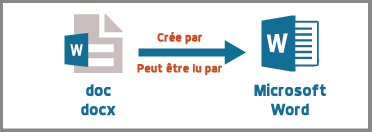
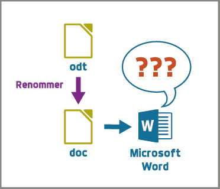
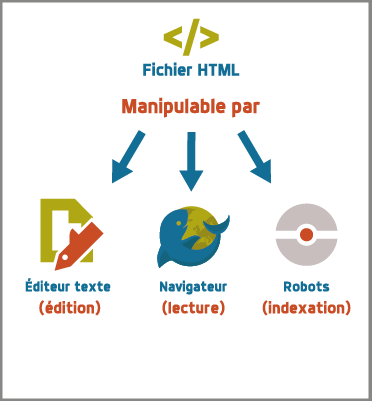
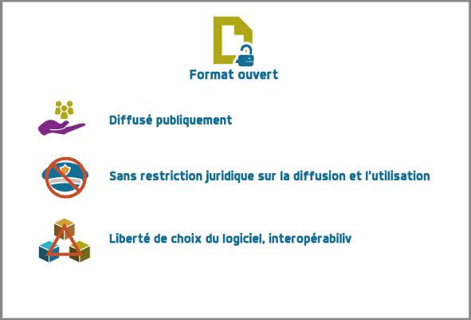
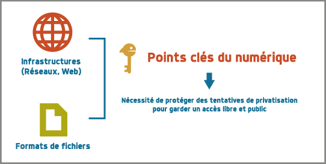
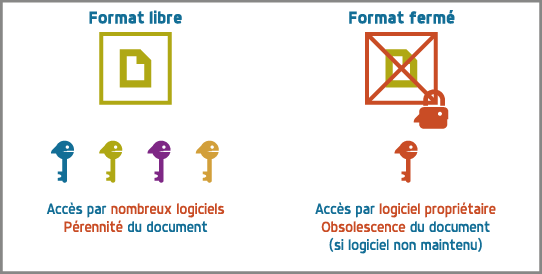

LANGUAGE:   fr
TITLE:   Représentation numérique de l'information : les documents
MENUTITLE: Les documents
AUTHOR:     Culture numérique
CSS: http://culturenumerique.univ-lille3.fr/css/base.css

# Représenter c'est choisir...

[Representer c'est choisir](https://vimeo.com/149277667){: .cours_video }

Pourquoi représenter l'information sous format numérique ? En premier
lieu, c'est un changement de support. Par exemple pour un roman, il
faut passer d'un support papier à un support numérique compréhensible
par une machine pour qu'elle puisse le stocker et l'afficher. Il faut
donc représenter le roman comme une suite de 0 et de 1 et inversement
passer de cette suite de 0 et 1 en un texte lisible.

Il faut aussi pouvoir échanger. Plutôt que de se prêter un roman sur
support papier, c'est sa représentation numérique qui sera copiée à
travers le réseau. Il est donc nécessaire que l'émetteur et le
récepteur (en l'occurrence les logiciels utilisés par chacun d'eux)
soient d'accord sur la façon de représenter l'ouvrage.

Retrouver le titre et l'auteur du roman est une tâche qui vous semble
évidente. Elle sera rendue plus facile et sûre pour une machine si la
représentation choisie contient explicitement la désignation du titre
et de l'auteur.

De même, considérons la classification du roman dans les catégories
policier, historique ou libertin.  Cette tâche est difficile pour une
machine sauf à spécifier dans la représentation la catégorie définie
par un expert humain. Terminons par l'exemple d'une vidéo. En tant
qu'humain, vous reconnaîtrez sans problème des personnages connus dans
les images. Ici encore, c'est une tâche très difficile pour une
machine sans une représentation adéquate et des informations
complémentaires. Par conséquent, la représentation numérique d'une
information peut être enrichie pour faciliter les traitements relatifs
à de telles tâches.

La numérisation ne se limite pas à un changement de support. En effet,
elle permet des traitements automatiques sur des grandes quantités de
documents.

Par exemple comment faire en sorte que votre smartphone reconnaisse un
morceau de musique chantonné ? À l'aide d'un logiciel transformant
les sons en un codage astucieux, votre voix est numérisée, puis la
représentation numérique qui a été produite est envoyée à un service
possédant un très grand nombre de morceaux de musique représentés avec
le même codage, après comparaison le morceau le plus proche pourra
être envoyé vers votre smartphone.

Nous allons dans ce module, présenter les bases de la représentation
numérique de l'information. Ce domaine est vaste. Nous avons fait le
choix de nous restreindre à un message principal : la représentation
numérique d'une information est un processus conçu par l'homme,
reposant sur des choix conceptuels, organisationnels et scientifiques
et assurant la possibilité de traitements numériques.  Divers critères
vont gouverner le choix d'une telle représentation :

- la pertinence : modélise-t-elle bien l'information et permet-elle de
  réaliser les traitements souhaités ?
- l'économie : est-elle économe en taille pour permettre un stockage
  et des échanges rapides ?
- l'efficacité : les traitements envisagés pourront-ils se faire rapidement ?
- la sûreté ou la confidentialité : permet-elle de cacher
  l'information ou d'en contrôler les accès ?

Cette liste est non exhaustive.  Les concepteurs, informaticiens en
relation avec des experts métier, vont effectuer les choix de
représentation. C'est un processus créatif complexe car l'espace des
solutions possibles est immense, ce qui explique la très grande
diversité des représentations numériques.

Un choix de représentation aura un impact important sur les
traitements possibles. Ces traitements sont accessibles à
travers des logiciels et prendre conscience des choix de
représentation contribue à une compréhension plus profonde et une
utilisation bien plus efficace et réfléchie de ces logiciels.

Nous allons considérer, dans un premier temps, la représentation
numérique des documents textuels. Le cours devrait vous permettre de
transposer les notions présentées dans d'autres domaines. En
particulier, à la fin du cours, les questions liées à la parole,
l'image et la vidéo seront esquissées pour vous guider dans le monde
numérique multimédia.

```compréhension
::Représenter et manipuler::
[markdown]
Les traitements possibles dépendent fortement des choix de représentation
{T}

::Quelles données ?::
[markdown]
La représentation numérique d'un livre peut inclure des données qui ne se limitent pas au contenu textuel. Donnez quelques exemples.
{#### Le genre, la date de création, l'éditeur, ...}

::De la variété ?::
[markdown]
Il n'existe qu'une seule façon de représenter numériquement un livre.
{F #Représenter une information est le résultat de nombreux choix}

::Comment choisir ?::
[markdown]
Donnez des exemples de critères qui peuvent gouverner le choix d'une représentation numérique.
{#### la concision, la pertinence (permettre des traitements voulus), l'efficacité (les traitements sont réalisés rapidement, la confidentialité (l'accès aux données  peut être contrôlé),...}

::Qui choisit ? ::
[markdown]
Les choix de représentations sont faits par
{
~Les informaticiens #non pas seuls car intervient aussi l'utilisation métier des objets représentés
~Les experts métier #non pas seuls car il faut des spécialistes des données numériques et des algorithmes
=Les deux #oui et souvent aussi des chercheurs, des entreprises, ...
}
```

```activité
::Une tâche complexe::
[markdown]
Représenter et normaliser est une tâche complexe : l'exemple de HTML. En vous rendant sur les pages wikipedia de [HTML](https://fr.wikipedia.org/wiki/Hypertext_Markup_Language) et du [W3C](https://fr.wikipedia.org/wiki/World_Wide_Web_Consortium). Répondez aux questions suivantes :
\n
- Quelle est l'origine de `HTML` ?
- Qui développe et publie les spécifications `HTML` depuis 1995 ?
- Quelle est la version la plus récente de `HTML` et son année de parution ?
- Qui participe au développement du standard `HTML` au `W3C` ?
- Quelles sont les étapes pour arriver à être une recommandation ?
- Qui est responsable du standard `css` pour les feuilles de style ?
{#### origine au CERN ; Le W3C développe le HTML depuis 1995 ; HTML5 en 2014 ; industriels, éditeurs logiciels, chercheurs, entreprises du Web, ... ; brouillon, appel, candidat, proposition et recommandation ; le W3C.}
```

# Analyse d'un document : plusieurs vues complémentaires
[Des vues complémentaires](https://vimeo.com/149277666){: .cours_video }

### Introduction
Dans cette section, nous analysons ce qu'est un document textuel pour
déterminer les critères amenant à une bonne représentation numérique.
Le cours sur le Web a déjà introduit un exemple de représentation
numérique de document dont une caractéristique essentielle est de
représenter contenu et structure d'un côté dans le langage `HTML` et
présentation d'un autre côté avec une feuille de style `CSS`. Cette
représentation facilite les traitements et la transmission à travers
les réseaux et permet l'affichage sur tout type d'écran. Cette
distinction entre structure, contenu et présentation est plus générale
et résulte de l'analyse de ce qu'est un document textuel.

L'analyse des documents textuels met en évidence *quatre vues
complémentaires* : les vues séquentielle, structurée, qualifiée et de
présentation.


### Le contenu, une vue séquentielle

Le premier constat évident est qu'un document textuel est une suite de
symboles. C'est la *vue séquentielle* du document.  L'ordre est
important et le parcours naturel est de commencer par le début, passer
d'un symbole au symbole suivant jusqu'à la fin.

Grâce à cette organisation séquentielle, il est déjà possible
d'imaginer des traitements : rechercher, remplacer, couper, copier,
coller, identifier des mots et pourquoi pas en vérifier l'orthographe,
...


### La structure, une vue arborescente

Les mots, phrases et paragraphes définissent une première
structuration du document. Cependant, tout document textuel contient
des niveaux plus abstraits de structuration : un livre contient une
page de titre, une page de garde, une préface, des chapitres ; un
rapport contient un titre, un résumé, une introduction, des sections
et sous-sections, des listes, etc... C'est la **vue structurée**. Elle
est souvent hiérarchique ou arborescente car il y a des relations
d'inclusion : un paragraphe dans une sous-section dans une section
dans le document.

Grâce à cette organisation structurelle, de nouveaux traitements sont
disponibles : extraire le résumé, numéroter les sections, construire
une table des matières, réordonner des sections avec mise à jour de la
table des matières, ...


### Les métadonnées, une vue qualifiée

Une troisième vue découle de besoins que l'on peut illustrer par les
exemples suivants : un utilisateur peut souhaiter retrouver la date de
création d'un document, un bibliothécaire cherche des documents par
auteur, par titre, par mot-clef, par édition et numéro d'édition, ou
encore par date. Ces éléments ne figurent pas nécessairement dans le
document mais ils le qualifient. Ce sont des *méta-informations* (ou
*métadonnées*), c'est-à-dire des informations à propos des
informations. Elles forment la **vue qualifiée** du document. Très
souvent ces informations sont mémorisées sous la forme de propriétés
(ou attributs) ayant une valeur.  Par exemple, la propriété `titre`
de ce document vaut `Culture numérique`, la propriété `datecréation`
de ce document vaut `10 septembre 2015`, etc...

Grâce à cette vue qualifiée et ces *métadonnées*, les traitements sur
des ensembles de documents sont facilités : on peut classer par
auteur, rechercher par titre, ordonner des versions par date, ...


### La présentation, une vue pas uniquement graphique

Enfin, les choix du dessin de chaque caractère, de leur taille, de la
couleur du titre, de la taille des marges, etc.  participent à **la
présentation ou forme** du document. Cette forme va s'appliquer au
contenu en s'aidant de la structure mais il est important de bien
distinguer la **présentation** et le **contenu structuré**. En effet,
comme vous l'avez vu dans le cours sur le Web, la séparation entre
contenu et structure dans un fichier `HTML` et présentation dans une
feuille de style `css` permet d'afficher un même contenu avec
différentes formes mais aussi de faciliter certains traitements.
Enfin, soyez vigilants car les traitements de textes entretiennent la
confusion entre contenu, structure et forme. Or, un document mis en
forme **n'est pas** un document structuré. Les interfaces proposées qui
semblent très intuitives entraînent souvent de mauvais apprentissages
et de mauvais usages.

Cette vue de présentation est néanmoins très importante pour des
questions de communication et de diffusion car il faut toujours
adapter la forme à la fonction du document. La forme d'un document
pour impression et lecture diffère de la forme d'un document pour
affichage sur écran. La forme peut dépendre de l'objectif de
communication visé.

### Un point d'étape

Chacune des vues contenu, structure, qualifiée et de présentation est
importante.  Elles contribuent toutes, à des degrés divers, à des
objectifs complémentaires : l'intelligibilité est essentiellement
portée par le contenu et la structure ; la lisibilité est
majoritairement une affaire de présentation ; la capacité à être
efficacement traité par une machine repose sur le contenu, la
structure et les *métadonnées*.

```compréhension
::Vrai ou Faux : vue séquentielle::
[markdown]
Avec la vue séquentielle, on peut remplacer les occurrences d'un mot par un autre mot.
{T}

::Vrai ou Faux : vue structurée::
[markdown]
Avec la vue structurée, on peut créer une table des matières automatiquement
{T}

::Vrai ou Faux : vue présentation::
[markdown]
Un contenu avec une structure a une seule présentation possible
{F}

::La vue qualifiée::
[markdown]
Donnez au minimum 4 métadonnées que vous pouvez associer à un livre
{}

::Éditeur de textes::
[markdown]
Parmi les fonctionnalités suivantes, lesquelles sont possibles ?
{
~%25%copier/couper/coller #tous les éditeurs le permettent
~%25%rechercher et remplacer #très souvent disponible
~%25%avancer de mots en mots #souvent par la conjonction CRTL-flèches
~%25%corriger l'orthographe #certains le font
~%-100% mettre en gras #l'éditeur ne permet pas d'enregistrer des mises en forme (il est possible toutefois d'écrire des commandes de mise en forme : un mot n'est pas en gras mais un texte dans un langage peut exprimer l'ordre de mettre en gras)
}

::Le jardin zen::
[markdown]
Pour illustrer à la fois la pertinence de séparer les informations de présentation des autres informations textuelles, mais aussi l'effort de la communauté dans cette direction notamment avec les feuilles de style (CSS ou de documents de traitement de textes).  Regardez ces différents liens sur le site la beauté des CSS :
\n
- [http://www.csszengarden.com/tr/francais/](http://www.csszengarden.com/tr/francais/)
- [http://www.csszengarden.com/tr/fr/221/](http://www.csszengarden.com/tr/fr/221/)
- [http://www.csszengarden.com/tr/fr/219/](http://www.csszengarden.com/tr/fr/219/)
\n
Entre ces différents designs, qu'est-ce qui change ?
{
~%0% La structure #non, elle reste la même, vérifiez l'identité des codes HTML avec l'affichage du code (`CTRL-U` sur *PC*, `cmd-U`sur *Mac*)
~%0% Le contenu #non, lisez bien, les textes sont les mêmes!
~%100% La présentation #oui uniquement la CSS qui ne contient que des éléments de présentation est adaptée.
}
```

```activité
::Installer LibreOffice::
[markdown]
Les activités seront proposées avec le traitement de textes `LibreOffice`. Vous pouvez l'installer depuis le site [http://fr.libreoffice.org/](http://fr.libreoffice.org/).
Rappelez-vous que vous devez installer des logiciels depuis les sites officiels uniquement.
Les activités peuvent aussi être réalisées depuis les salles d'accès libre de l'université où tous les logiciels nécessaires sont disponibles.
{}


::La structure d'un document texte odt::
[markdown]
**La structure d'un document texte odt**
Téléchargez le  [document odt](media/representation.odt) sur votre machine. Notez bien l'emplacement où vous l'enregistrez. Lancer `LibreOffice` puis ouvrir le document. Pour explorer sa structure :
\n
- Ouvrez le *navigateur de `LibreOffice`* (touche F5). Ici, le mot navigateur ne désigne pas un navigateur Web mais une fonctionnalité fournie par `LibreOffice` pour naviguer dans la structure du document.
- Dépliez tous les niveaux de titre pour faire apparaître la structure complète des titres du document.
- Rendre une capture de cette fenêtre de navigateur.
- Réorganisez la structure : avec le document, déplacez la partie 4.2 en la plaçant juste après la partie 2.2. Pour cela, n'utilisez pas de copier coller mais uniquement les fonctionnalités offertes par l'usage du *navigateur* (touche `F5`).
- Rendre une capture d'écran de la structure obtenue visible dans le *navigateur*.
- Mettez à jour la **table des matières** qui se trouve en début de document : `clic-droit` dans la partie grisée de la table des matières et sélectionner `Actualiser l'index`.
{####Voila une première approche de l'utilisation des styles dans un traitement de texte qui permet d'avoir un document structuré. La manipulation que vous venez de faire (déplacement d'une section) illustre l'organisation arborescente du document. Le déplacement d'un noeud déplace en fait toutes les sous-parties de ce noeud. Par ailleurs, la définition de "niveaux de titre" pour certains noeuds de la structure permet la création automatique (et ici la mise à jour automatique) de la table des matières. Cela ne représente qu'une petite partie des possibilités qu'offre une organisation structurée d'un document texte.}


::La vue qualifiée d'un document texte odt::
[markdown]
Ouvrir le document [document odt](media/representation.odt) dans `LibreOffice`. Recherchez dans les menus comment trouver les propriétés suivantes :
\n
- le titre,
- le sujet,
- les mots clef,
- la date de création.
\n
Faites une capture d'écran de la fenêtre où vous avez trouvé ces métadonnées.
{####Les métadonnées que vous avez trouvées dans cet exercice ont toutes été saisies par une personne. Elles permettent de qualifier le document, de donner des informations sur l'information principale qu'est le contenu. Comme nous l'avons déjà vu avec les éditeurs de texte, les traitements de texte sont aussi capables de**calculer** automatiquement d'autres informations qui dépendent du contenu comme le nombre de mots, de paragraphes ou de signes.}


::Un document peut être réduit à des métadonnées::
[markdown]
C'est le cas des notices bibliographiques des bibliothèques dont la plus grande partie des fonds n'est pas numérisée. Par conséquent, le contenu des livres n'est pas représenté numériquement et chaque ouvrage est défini par des métadonnées regroupées dans une notice. Nous prenons en exemple le [Catalogue des bibliothèques du SCD de Lille 3](http://hip.scd.univ-lille3.fr/ipac20/ipac.jsp?profile=).
\n
- Faites une requête comme, par exemple, `représentation information`
- Parcourez une ou plusieurs notices des ouvrages en réponse
- Examinez le contenu de `Sujets` et donnez le rôle de ces métadonnées
- Indiquez sur quels critères vous pouvez effectuer une recherche.
{#### les métadonnées dans Sujets sont des concepts ou thèmes associés à l'ouvrage, ils sont produits manuellement par des experts bibliothécaires. Vous pouvez rechercher selon les métadonnées comme les dates, les auteurs, etc. Vous ne pouvez pas faire de recherche plein texte dans l'ensemble du texte d'un livre, sauf éventuellement sur des résumés.}


::La structure d'une page web::
[markdown]
La structure arborescente est encore plus présente dans les documents au format `HTML`. Les balises sont imbriquées les unes dans les autres et l'ensemble peut être représenté par un arbre. Pour observer cela :
\n
- Lancer `Firefox`, rendez-vous sur la [page exemple](http://culturenumerique.univ-lille3.fr/activitesWeb/html).
- Pressez les touches `CTRL-MAJ-C` (`alt-cmd-C` sur les Mac). La fenêtre de l'inspecteur de code `HTML` s'ouvre.
- Dans cette fenêtre, observez la structure du document `HTML`. Cliquez sur les petites flèches pour découvrir ou cacher les parties de code `HTML` incluses les unes dans les autres.
- Sur quelles petites flèches devez-vous cliquer pour arriver au texte *Vous pouvez changer la taille...* ?
- La liste des balises associées à chacune de ces petites flèches apparaît dans la zone située juste au dessus du code `HTML`. Par exemple, `html>body>section>p`. Elle représente le chemin dans l'arbre associé au document, depuis sa racine jusqu'au texte sélectionné. Sur l'exemple, un paragraphe dans une section dans le corps du document `HTML`.
\n
Quel est le chemin pour arriver au texte *Vous pouvez changer la taille...* ?
{####html/body/section/ul/li}
```

```activité-avancée
::Mise en forme et structure::
[markdown]
Téléchargez les deux fichiers suivants :
\n
- [representation1](media/representation1.odt)
- [representation2](media/representation2.odt).
\n
Ouvrez et parcourez ces deux fichiers. Sont-ils identiques ? Qu'est-ce qui les différencie ? Illustrez votre propos en citant des opérations qui seraient plus facilement réalisables avec l'un plutôt qu'avec l'autre et pourquoi.
{####Les documents semblent identiques, mais les éléments de structure ne sont pas désignés dans le second. Vous ne pouvez pas réaliser de traitements comme : la réorganisation des sections, la génération des tables de matières, etc.
\n
Par ailleurs, si vous observez bien, plusieurs défauts majeurs apparaissent dans *representation2.odt* : certains titres se retrouvent isolés en bas de page (p3 et p5), le dernier titre en bleu (page 4) est d'une taille légèrement inférieure aux autre titres en bleu. Ces petites erreurs sont courantes lorsqu'on tente de faire la mise en forme "à la main". Aucune de ces erreurs ne peut se produire dans *représentation1.odt* car les styles des paragraphes prennent en charge entre autre : les veuves et les orphelines (au moins 2 lignes en bas de page ou en haut de page), les titres sont toujours sur la même page que le paragraphe suivant, ce qui évite des titres en bas de page, et les taille, couleur, police, ... choisis sont sélectionnés une seule fois au moment de la définition du style, ce qui signifie qu'AUCUNE différence de forme ne peut intervenir entre 2 paragraphes associés à un même style. La mise en forme de documents longs est donc grandement facilitée par l'utilisation de styles de paragraphe.
\n
En résumé : les styles permettent de STRUCTURER le document (génération automatique d'une table des matières, vision en mode plan et facilité de réorganisation), ils sont donc essentiels pour la vue Structurée du document, mais ils sont aussi précieux pour la vue de présentation en faisant gagner beaucoup de temps et en augmentant considérablement la qualité du document. Nous allons illustrer cela dans la suite des activités.}

::Réutilisation de styles::
[markdown]
Vous avez manipulé jusqu'ici
\n
- *representation.odt*, un document structuré utilisant les styles par défaut, toutes les opérations liées à la structure du document sont donc accessibles (cf activité *structure d'un document texte*), mais la mise en forme est très basique.
- *representation1.odt* qui est lui aussi structuré et dont les styles des différents niveaux de paragraphe ont été modifiés (taille, typo, couleur, alignement, etc).
\n
Nous allons maintenant réutiliser les styles définis dans *representation1.odt* pour **modifier la présentation sans modifier la structure** de *representation.odt*. Il existe différentes méthodes pour effectuer cela.
\n
Le principe repose sur le fait que les 2 documents utilisent les mêmes noms de styles (les styles par défaut) à savoir :
\n
- `Titre`, pour le titre principal du document
- `sous-titre`, pour le sous-titre
- `Titre 1`, pour les titres de premier niveau
- `Titre 2`, pour les titres de deuxième niveau
- `corps de texte`, pour tous les paragraphes standards
\n
Il s'agit donc de demander à `LibreOffice` d'aller chercher les paramètres de présentation de ces différents styles tels qu'ils sont définis dans le document *representation1.odt*. Cela s'effectue en quelques clics ...
\n
À vous de faire cette manipulation très simple. Cherchez dans l'interface de `LibreOffice` comment effectuer cette opération. Si vous rencontrez des difficultés, n'hésitez pas à aller dans les salles d'accès libre où la dernière version de `LibreOffice` est installée et où des moniteurs peuvent vous aider.
\n
Pensez aussi à utiliser le forum du cours pour poster vos questions ou vos remarques et vous aider mutuellement.
{}

::Générer une table des matières::
[markdown]
Comme vous avez pu le constater, *representation1.odt* est structuré et il possède une mise en forme des styles, mais la table des matières n'a pas été créée. Vous allez donc la créer maintenant. Les styles des titres ont été paramétrés pour correspondre à des niveaux différents dans la structure arborescente du document. La génération de la table des matières peut donc se faire en 3 clics ...
\n
- Cherchez dans les menus de `LibreOffice` comment insérer une table des matières automatiquement.
- Faites une capture d'écran montrant la table des matières que vous avez créée.
{}

::Numéroter les paragraphes::
[markdown]
Nous allons pour finir utiliser une fonctionnalité qui utilise encore la structure arborescente (avec des niveaux imbriqués) du document. Il s'agit de la numérotation automatique des paragraphes. Chacun des titres (Titre 1 ou Titre 2) correspondant à un niveau, le traitement de texte peut facilement les retrouver et calculer les numéros. Ainsi, à chaque nouvelle partie (Titre 1), la numérotation des sous-parties (Titre 2) recommence à 1.
\n
Chercher dans `LibreOffice` comment numéroter automatiquement les parties en utilsant la notation suivante :
\n
A / REPRÉSENTER C’EST CHOISIR…
\n
B / ANALYSE D'UN DOCUMENT,
\n
PLUSIEURS VUES COMPLÉMENTAIRES
\n
1 - Introduction
\n
2 - Le Contenu, Une Vue Séquentielle
\n
etc.
{}
```

# Documents numériques - formats et normes

### Pourquoi et comment

Chacune des vues va contribuer à la représentation numérique d'un
document textuel, mais, selon le domaine d'application, elle sera plus
ou moins importante ou nécessaire. La première question est : **que
veut-on représenter en vue de quels usages ?** Des choix techniques
seront associés pour répondre à la question : **comment représenter ?**
Cette distinction entre le quoi et le comment est, en informatique
comme dans beaucoup d'autres sciences, une approche essentielle des
problèmes.

### Différents formats pour différents usages
Les choix effectués pour répondre à la question **comment représenter
des documents textuels** aboutissent à des **formats** de
représentation. Vous connaissez sans doute certains de ces formats
précisés avec les abréviations suivantes :

- le format `txt` pour les textes,
- le format `doc` ou le format  `docx` du traitement de textes Word,
- le format `odt` des traitements de textes LibreOffice ou OpenOffice,
- le format `pdf` pour l'impression,
- le format `html` pour les hypertextes.


Vous noterez, que pour de mêmes usages, comme la composition de
documents textuels, il existe des formats différents comme `doc` et
`odt`. Vous noterez également que les formats évoluent avec les usages
et les technologies. Par exemple `HTML` a été défini dans des versions
successives depuis le début des années 90 jusque `HTML5`, paru
en 2014.


### Formats et logiciels

Nous avons expliqué la relation forte entre le choix de la
représentation et les traitements qui peuvent être faits sur une
donnée numérique. D'un point de vue très concret, cette relation se
traduit souvent par la liaison entre un format et une application
spécifique d'un éditeur logiciel. Par exemple, un document textuel au
format `doc` est associé au logiciel `Word` de Microsoft. Il aura
souvent été créé avec ce logiciel et pourra être lu et modifié avec ce
logiciel.

Un document dans un format pourra être stocké dans un fichier. Pour
des raisons historiques, le format d'un document est souvent précisé
dans l'extension du nom de fichier constituée de trois ou quatre
lettres après le point. On désigne même abusivement un format par
cette extension, comme nous l'avons fait précédemment en parlant de
format `doc` par exemple. Cette extension peut être vue comme une
métadonnée qui dit : "le document dans ce fichier respecte le format
de représentation de documents utilisé par le logiciel `Word`".



Si nous avons un document textuel au format `odt`, il ne suffit pas de
le renommer avec l'extension `doc` pour le rendre lisible par Word. Il
faut réaliser une **conversion** d'un format dans l'autre, opération qui
peut être difficile voire impossible. Pourquoi ? Pour au moins deux
raisons :

1. Tout d'abord, les choix qui ont été opérés pour définir les formats
   ne sont pas toujours compatibles.  On peut donc perdre des
   informations lors de cette conversion.
4. Ensuite, les choix ne sont pas toujours rendus publics. On ne peut donc pas toujours écrire de programme de conversion.



Par ailleurs, un document textuel dans un format peut être parfois
manipulé avec des logiciels différents pour des besoins différents.
Par exemple, un fichier `html` peut être ouvert par un navigateur pour
le visualiser.  Le même fichier peut être ouvert avec un éditeur de
texte pour le modifier. Comme vous l'avez vu dans le cours du Web, il
sera également manipulé par les robots des moteurs de recherche qui
contribuent à indexer le web.



### Ouvert ou propriétaire

Le processus de choix de représentation et de définition d'un format
est complexe et coûteux. Il peut être aussi stratégique d'un point de
vue industriel ou commercial. Dès lors, les créateurs ont la
possibilité de le rendre disponible pour tous librement ou non, de le
cacher ou de le protéger par des brevets.

#### Formats ouverts
On parle de **format ouvert** si le format est diffusé publiquement.


Par
exemple, vous pouvez accéder librement sur le Web à la définition du
format `HTML5`.  De plus, aucune entrave légale n'accompagne
l'utilisation d'un format ouvert et de ce fait, un format ouvert n'est
pas lié à un logiciel. En effet, plusieurs logiciels différents
peuvent librement lire ou écrire les informations représentées dans ce
format. On facilite ainsi l'interopérabilité. Par exemple, le format
`html` est utilisé par de nombreux logiciels et même au delà du Web.



#### Formats fermés
On parle de **format fermé** ou propriétaire lorsque des restrictions
d'accès et/ou d'utilisation s'appliquent.


 Être propriétaire d'un format très répandu donne une puissance économique très importante dans notre monde numérique et une position dominante. En effet, la
conversion étant impossible, une mise en concurrence est rendue très
improbable et les utilisateurs sont alors contraints d'utiliser le
logiciel associé. Si `HTML` avait été un format fermé, sans doute le
web serait-il très différent de celui d'aujourd'hui ou n'existerait
peut-être même pas.


### Une minute citoyenne

Le numérique est aujourd'hui un facteur de développement économique
important. Ce développement repose en partie sur des infrastructures
comme les réseaux, le web, étudiés dans les semestres précédents. Les
organisations publiques mondiales, pour ne pas freiner ce
développement ont mis en place des normes et étudient des garanties
pour un accès neutre et de qualité à ces infrastructures. Les normes
du W3C sont un exemple. Le débat actuel sur la neutralité du net est
une autre illustration. Par le passé et encore aujourd'hui plusieurs
entreprises, par des moyens techniques ou commerciaux tentent
d'accaparer ce que beaucoup pensent être soit un bien public soit des
données personnelles. Mais ces infrastructures ne sont pas le seul
point d'accès au numérique. La question des formats de représentation
des données entre évidemment dans l'éventail des possibilités de
contrôler l'économie du numérique.



Lorsque vous enregistrez un document dans un certain format, c'est un
peu comme si vous rangiez un objet dans une boite. Si le format est
propriétaire et protégé, alors cela signifie que lorsque vous voulez
retrouver votre objet vous devez vous adresser à un tiers qui lui seul
a l'autorisation d'ouvrir la boite. La question de savoir si l'objet
vous appartient toujours se pose donc, ou encore celle de la liberté
d'utiliser cet objet.

Transposée dans le monde numérique, cette image signifie que limiter
cet accès a de nombreuses conséquences. L'interopérabilité est rendue
plus difficile : un document dans un format propriétaire, ne peut être
librement utilisé dans un autre logiciel. La liberté des utilisateurs
est également atteinte : en échangeant avec un format propriétaire,
vous forcez vos interlocuteurs à utiliser un logiciel précis.



Enfin,
lorsqu'il s'agit de données sensibles ou devant être archivées pour
une très longue durée, l'usage de formats propriétaires repose sur des
logiciels qui peuvent disparaître ou changer leur règles
d'utilisation...

Comme pour les infrastructures, l'État et bien d'autres organisations
sont conscientes de ces difficultés. Elle produisent souvent des
directives, circulaires pour inciter à utiliser des formats ouverts et
libres. Mais il est bien plus difficile de convaincre les utilisateurs
souvent plus enclins à continuer selon leurs habitudes, résultant
souvent de nombreux efforts d'apprentissage.

De votre côté, recevoir une formation indépendante des outils, donc
plus fondamentale peut contribuer à être moins dépendant et moins
servile dans ce monde numérique. Mais cela demande un effort
particulier, une attente moins centrée sur l'immédiat et l'utilitaire,
un peu moins personnelle car prenant conscience d'enjeux
communautaires.

```compréhension
::Extensions de fichier::
[markdown]
Dans le nom de fichier `mondocument.txt`, quelle est l'extension ?
{####txt}

::Éditeur de textes et fichier doc::
Avec un éditeur de textes, je peux ouvrir un fichier doc
{F #Non, un fichier doc contient des informations spécifiques au logiciel Word}

::Éditeur de textes et HTML::
Avec un éditeur de textes, je peux ouvrir un fichier HTML
{T # Oui car c'est un fichier texte simple décrivant une page Web}

::Contenu et présentation::
Un contenu avec une structure a une seule présentation possible
{F # Non, on peut appliquer différentes mises en forme}

::Conversions de formats::
[markdown]
Est-il toujours possible de convertir un document d'un format vers un autre format ?
{F #Non, il faut qu'un tel programme de conversion existe et parfois les formats ne sont pas publics et la conversion est alors très difficile ou impossible. }

::Format ouvert et interopérabilité::
Un format ouvert facilite l' interopérabilité
{T #Oui car il est diffusé et des logiciels différents peuvent le comprendre}
```

```activité
::Format .doc::
[markdown]
Lisez la page Wikipedia suivante sur [le format doc](https://en.wikipedia.org/wiki/Doc_%28computing%29) et cochez les réponses vraies.
{~%0% Les fichiers avec l'extension doc désignent  une chose unique. #Non, plusieurs logiciels distincts l'ont utilisé pour stocker la représentation de choses distinctes.
~%0% Ce format est ouvert. #Non, c'est un format propriétaire fermé.
~%50% Ce format est toujours développé ?#Oui
~%50% Ce format a été étendu. #Oui, docx ou Office Open XML
}

::Format PDF::
[markdown]
Lisez la page Wikipedia sur le [format pdf](https://wikipedia.org/wiki/Portable_Document_Format) et répondez aux questions suivantes
\n
- Est-ce un format ouvert ?
- Peut-on lire et écrire du `pdf` avec des logiciels différents ?
- Que signifie portable ?
- Les documents dans ce format peuvent-ils toujours être reconstitués à l'identique ? Pourquoi ?
{#### Oui il est ouvert mais seulement depuis 2008 et on peut lire et écrire du pdf avec des logiciels différents. Le mot portable signifie que le format tend à conserver au maximum l'apparence que le concepteur du document lui a donné quel que soit le dispositif de visualisation ou d'impression. Parfois cela ne peut être respecté pour la raison que certaines polices de caractères ne sont pas redistribuables (disponibles sur tout équipement).}
```

# Documents numériques textuels

[Documents numériques textuels](https://vimeo.com/151363295){: .cours_video }

Nous avons analysé ce qu'est un document textuel.  Nous avons mis en
évidence les quatre vues de contenu, de structure, de forme et
qualifiée. Nous avons discuté des formats de document. Nous allons
maintenant étudier comment peuvent être saisis des documents
numériques textuels. Nous allons voir deux approches :

- l'une dans laquelle on décrit les différentes vues sur le document
  dans un texte structuré,
- l'autre qui repose sur une approche plus orientée vers le rendu
  souhaité.

Auparavant, nous traitons la question du codage des caractères.

### Représentation numérique des caractères

Un document textuel est construit avec des caractères et une séquence
 de caractères correspond souvent à un texte intelligible par l'homme.
 Nous présentons donc, dans un premier temps, comment sont représentés en machine les *caractères*.

Précisons d'abord la notion de caractère en prenant l'exemple de la
langue française. Les caractères sont les minuscules, les majuscules,
les lettres accentuées, les chiffres, l'espace et les symboles de
ponctuation.  On peut aussi considérer des caractères comme le
 "e dans l'o" ou les symboles monétaires...

Mais avec l'internationalisation et la numérisation de textes anciens,
il faut être également capable de représenter tous les caractères de
toutes les langues, vivantes ou mortes.

Ce travail d'inventaire est long et complexe. Fort heureusement, il
existe des groupes internationaux qui ont pour mission d'établir des
normes pour la représentation numérique des caractères. C'est le cas
du consortium international *Unicode* fondé il y a plus de 20
ans. Il définit en premier lieu le *quoi*, c'est-à-dire quels
caractères ou symboles il faut coder. À l'heure actuelle, la plupart
des caractères et symboles de la très grande majorité des langues sont
codés. Mais le consortium introduit régulièrement des nouvelles
langues rares ou anciennes ou même des langages comme les Emoji.

Dans ces normes comme Unicode, ce ne sont pas les dessins qui sont
répertoriés mais les caractères eux-même. Cette distinction est
parfois assez subtile : majuscules et minuscules sont des caractères
différents mais un *a* minuscule en gras ou italique en écriture
attachée ou en script est toujours le même caractère. À ces
caractères, s'ajoutent des caractères particuliers, dits caractères de
contrôle souvent invisibles. C'est par exemple, le caractère qui
signifie la fin d'un fichier texte. D'autres proviennent même de
l'époque des machines à écrire comme la tabulation, le retour à la
ligne ou même le *retour chariot* qui permettait à la tête d'écriture
de revenir en début de ligne.

Le consortium unicode définit en second lieu le *comment*. Il s'agit
d'associer à tout caractère pris en charge par Unicode, un nom et un
numéro appelé *point de codage*.  Par exemple, A a pour nom "Latin
Capital Letter A" et pour numéro 65, * a pour nom "Asterisk" et pour
numéro 42. Ces choix ont une histoire et ont été faits de façon
astucieuse pour faciliter certains traitements. Par exemple, pour
passer d'une lettre majuscule de notre alphabet à la lettre minuscule
correspondante, il suffit d'ajouter 32 à son numéro. Avec Unicode,
tout caractère a donc un numéro, il reste à préciser comment ce numéro
est représenté comme une suite de 0 et de 1. Il existe
différents codages, le plus répandu en place est
`UTF-8`.

### Textes "simples"

Un document textuel peut être réduit à la seule vue séquentielle,
c'est-à-dire une simple séquence de caractères. Dans ce cas, le format
de représentation privilégié est celui communément appelé *texte
simple*, dont l'extension principale est `txt` et le logiciel
principal pour le manipuler est un *éditeur de textes*. Pour
l'utilisateur, il existe cependant un niveau implicite de structure :

- un *mot* est une suite de caractères séparés par des espaces ou des
  caractères de ponctuation ;
- une *phrase* est une suite de mots dont le premier commence par une
  lettre capitale et qui se termine par un point ;
- un *paragraphe* est une suite de mots séparés par des fins de
  paragraphes.

Ce niveau de structure n'est pas explicitement représenté. Par
exemple, il n'existe pas de codage de la notion de fin de mot. La
notion de mot est le résultat d'un traitement par la machine dépendant
des choix des concepteurs des logiciels qui peuvent reposer sur la
langue, de la définition des symboles de ponctuation.


### Des langages et des logiciels

Au delà de cette structure informelle ou naturelle (les mots, les
phrases et les paragraphes), nous avons vu qu'il était important de
structurer un document de manière plus explicite et plus précise en
déclarant des parties, sections, sous-sections, listes, etc.  La
définition de cette structure est exclusivement sous la responsabilité
humaine. C'est le concepteur du document qui sait quelle organisation,
quelle structure associer à son contenu.  Il existe deux grandes méthodes
pour interagir avec la machine, soit utilisant un langage spécifique
qui à l'aide de mots et de symboles permet de décrire la structure
comme avec le langage `HTML` dont nous avons déjà parlé, soit en
utilisant les fonctions prédéfinies d'un traitement de texte.
Étudions ces deux options un peu plus en détail.

### Textes structurés pour décrire des documents textuels

Pour définir un document textuel, on peut décrire les différentes vues
sur ce document. On parle alors de composition de document en mode
*WYSIWYM* pour "What You See Is What You Mean", en français *ce que
vous voyez est ce que vous vous représentez*. Pour cela, on va décrire
le document par un texte dans un langage de description.  Dans ce
langage certains caractères ou certaines suites de caractères ont un
sens particulier. Les éditeurs de texte servent à écrire directement
dans le langage de description, et des logiciels spécifiques sont
ensuite utilisés pour *calculer* une vue de présentation du document à
partir de sa description.

- *Les langages Wiki* ont été utilisés principalement pour composer
  des pages Web dans un langage simplifié. On utilise des conventions
  comme : une ligne qui commence par `*` est un titre, `**` pour un
  sous-titre. Une ligne vide sépare les paragraphes. Un programme
  de calcul peut construire une page Web à partir d'une description
  textuelle en langage Wiki.
- *Le langage LateX* utilisé pour la composition de documents dans le
  monde scientifique (articles, rapports, thèses, livres). Dans ce
  langage, le texte structuré décrit le contenu et la structure avec,
  par exemple, une section commence par la séquence de caractères
  `\section{titre de section}`. La forme est définie par les règles
  externes de l'édition scientifique. Un programme de calcul prend en
  entrée le document texte décrivant le document et produit en sortie
  un document lisible et imprimable au format `pdf` respectant ces
  règles d'édition.
- *Le langage html* utilise des caractères particuliers comme `<`, `>` et
  `/` pour définir des balises. Par exemple, les balises `<section>` et
  `</section>` permettent de définir une section. Le corps du document
  `html` contient le contenu et la structure. L'entête du document
  contient des méta données comme le codage des caractères utilisé par
  le navigateur pour un affichage correct de la page, mais aussi des
  mots clés à destination des robots pour une bonne indexation du
  document. Enfin, la forme est définie dans un fichier texte
  structuré (une feuille de style) dans *le langage css*.


### Traitement de textes

Quand la définition de la structure se traduit par une suite d'actions
dans un logiciel, on parle alors de composition *WYSIWYG* pour "What
You See Is What You Get" en français *ce que vous voyez est ce que
vous obtenez*. Dans ce mode de composition, vos actions définissant la
structure, le contenu ou la présentation sont immédiatement
interprétées par le logiciel. Vous voyez donc à l'écran une image
presque fidèle du document imprimé final.  Les logiciels de
*traitements de textes* comme `Word` ou `LibreOffice Writer` ou même
certains éditeurs de contenu Web fonctionnent selon ce principe.

Le mode WYSIWYG semble très facile d'accès car vous échappez à
l'apprentissage contraignant d'un langage de description très
formel. Mais vous ne devez pas oublier que l'interaction avec le
logiciel repose toujours sur les vues structure, contenu, forme et
métadonnées lorsque vous composez un document textuel. En effet, si
vous les respectez, vous aurez alors facilement accès aux
fonctionnalités de haut niveau des traitements de texte : la
génération automatique de table des matières, de bibliographie,
d'index ; la réorganisation des sections ; la modification de la
présentation dans tout votre document ; ...

L'apprentissage de cette interaction est alors d'apprendre le sens de
certaines actions. Vous apprendrez par exemple que le rôle de la
touche `entrée` est d'indiquer une fin de paragraphe ; que la
déclaration des sections se fait en cliquant sur le texte du titre
puis dans une liste pour sélectionner le niveau de titre etc.

#### Comment procéder ?

Une dernière caractéristique commune aux langages de description et
aux traitements de texte est qu'ils sont extensibles et permettent de
s'adapter à des domaines spécifiques. Par exemple, la structure d'un
manuel scolaire peut comprendre la notion d'exercice, d'activité, de
leçon etc. Être capable de traduire dans la composition de documents
chacun de ces éléments structurels est une plus-value qui permet des
traitements adaptés, que ce soit dans la présentation ou
l'interrogation. Donc une démarche d'analyse préalable à la création
d'un document s'avère nécessaire.

Réaliser cette analyse, c'est comprendre qu'un document a des
objectifs, qu'il doit parfois respecter des règles liées à ses
objectifs. Vous devez avoir réfléchi à ces objectifs, au contenu et à
la structure la mieux adaptée. La démarche de composition d'un
document suivra, en général, l'ordre suivant :

1. Saisir le contenu textuel ou importer ce contenu textuel. Votre
   texte doit respecter les règles de typographie de la langue du
   document. Votre texte doit être structuré en paragraphes.
2. Effectuer les déclarations de structure : sections et titres de
   sections, listes, ... Ces déclarations sont faites à l'aide de
   styles (par exemple titre de niveau 1). L'emploi du mot style est
   regrettable car il entraîne des confusions.
3. Effectuer les choix de présentation basés sur la structure. Par
   exemple, vous préciserez que le style titre de niveau 1 sera
   présenté en gras, police Times, 14 pt, avec un retrait à droite de
   1cm et un espacement avant de 0.5cm et un espacement après de 0.2
   cm.
4. (3-bis) Cela revient à dire qu'il est préférable de ne *jamais* utiliser
les boutons de mise en forme directe qui sont pourtant en bonne
position dans l'interface... Toute les *mises en forme* doivent être
associées aux éléments de structure, et pas à des portions de texte
que l'on aurait sélectionnées.

Dans la pratique, il peut être intéressant de réutiliser une mise en
forme pour plusieurs documents. Par exemple, tous les rapports d'une
même entreprise respectent la même présentation. Pour cela, on utilise
la notion de *modèle de document*.

Enfin, la plupart des métadonnées comme auteur, date de création,
date de dernière modification sont ajoutées automatiquement par
l'outil s'il a été correctement paramétré au préalable mais vous
pouvez ajouter explicitement des métadonnées.

#### Erreurs communes
Les modes WYSIWYG induisent souvent de mauvaises
pratiques. En effet, un utilisateur a souvent tendance à se laisser
guider par le rendu sur l'écran en oubliant que

- les règles typographiques utilisées par le logiciel vont venir
  modifier ce rendu. Par exemple, c'est le logiciel qui va calculer la
  largeur d'une espace.
- des modifications ultérieures de contenu vont changer la mise en
  page. Par exemple, l'ajout d'un paragraphe peut changer toute la
  mise en page du document complet.

Nous vous donnons donc les conseils suivants :

1. *Respecter les règles de typographie, en particulier de ponctuation*
2. *Ne pas aligner/décaler des parties de textes avec des espaces*
3. *Ne pas mettre en page en créant des paragraphes vides*
4. *Ne pas utiliser les boutons de mises en forme directe*

```compréhension
::Unicode def::
[markdown]
Qu'est-ce que Unicode ?
{~une manière standardisée de dessiner des caractères d'une langue. #Non!
=un standard qui attribue à chaque caractère dans de nombreuses langues, un nom et un numéro. #Correct}

::Point de codage::
[markdown]
Quel est le **point de codage Unicode** du *point d'exclamation* (!) et son nom ?
{#### 33, mais encore 0x0021 en notation hexadécimale, et son nom est EXCLAMATION MARK}

::Caractère informatique, caractère et glyphe::
[markdown]
En informatique le caractère est un peu différent du caractère en typographie...
{~%30%Le caractère informatique est une notion abstraite pour désigner un symbole d'écriture. # oui
~%30%Le caractère informatique peut être invisible. #oui
~%30%Le caractère typographique ou glyphe est le dessin imprimé ou reproduit à l'écran. #oui
~%-100%Le caractère informatique est une émoticône qui permet de représenter un sentiment. #non, même si les émoticônes (emoji) font partie des caractères unicode, ils ne se réduisent pas à cela.
}

::Caractères sans glyphe::
[markdown]
Donner des exemples de caractères non imprimables
{####l'espace bien-sûr, mais aussi le retour à la ligne, la fin de fichier, la tabulation,...}

```

```activité
::Autres codes -- Un code mécanisé::
[markdown]
\n
- Que permettait de représenter le [code Baudot](https://fr.wikipedia.org/wiki/Code_Baudot) ?
- Pourquoi aujourd'hui ce *code Baudot* n'est plus utilisé pour représenter les caractères?
{####32 caractères uniquement : les lettres, les chiffres, la ponctuation, et quelques autres symboles (=, +, -, /, *, &, #...) ;
Les symboles des langues autres que l'américain ne peuvent être représentés.}

::Autres codes -- un code par le signal::
[markdown]
\n
- Que permet de représenter le [code Morse](https://fr.wikipedia.org/wiki/Morse_%28alphabet%29)
- Ce code est basé sur des impulsions et des silences. Quels sont-ils ?
- Trouver pour quelle raison la lettre `E` a le plus court codage ?
{####les lettres et les chiffres ; impulsion courte notée `.` ou `ti`, impulsion longue notée `-` ou `taah` ; trois durées d'espacement entre impulsions, entre lettres, entre mots ; `E`: lettre la plus fréquente et souci de diminuer la longueur des transmissions}

::Unicode actu::
[markdown]
Rendez vous sur le [site Unicode](http://www.unicode.org/).
\n
- Allez dans le menu *Proposed Changes -- Proposed Characters*. Vous y verrez des caractères en attente d'intégration dans le standard.
- Allez dans le menu *The Consortium -- Who we are*. Constatez la diversité du consortium et de son organisation.
- Regardez les [caractères actuels](http://www.unicode.org/charts/).
- Regardez en particulier *Basic Latin* qui ont été les premiers caractères codés en informatique dans une table 'ASCII`.
{}

::Codage des caractères dans les pages Web::
[markdown]
Les caractères sont représentés conformément au standard `Unicode` et au codage `UTF-8` pour 80% des pages Web.
\n
- Ouvrez la [page suivante](media/pageSansDeclaration.html) puis ensuite cette [autre page](media/pageAvecEncodage.html)
- Que constatez-vous ?
- Consultez les codes sources de ces deux pages (utilisez la séquence de touches `CTRL-U` ou  `cmd-U` sur Mac pour l'obtenir) et voyez la différence. Recopiez la ligne qui déclare cet encodage du jeu de caractères.
{#### =<meta charset="utf-8">=. Ici =meta= signifie métadonnée, c'est-à-dire information à propos de ce document, =charset= est une contraction pour signifier jeu (ou ensemble) de caractères, et bien-sûr =UTF-8= spécifie l'encodage choisi.}


::Structure implicite::
[markdown]
Ouvrir le [fichier suivant](media/representation.txt) avec un éditeur de texte. Modifiez  la taille de la fenêtre de l'éditeur en l'agrandissant ou la réduisant. Quelles observations vous permettent de vérifier  que le paragraphe est bien un élément de structure et que la ligne n'est pas un élément de structure ?
{#### Les paragraphes marqués par un passage à la ligne restent séparés alors que les lignes varient selon la taille de la fenêtre}

::Compter les mots::
[markdown]
On considère le texte suivant :
\n
*Bonjour l'ami. Soyez curieux bien-sûr ; essayez-donc ! Signé : marc.latour@yahoo.com*
\n
- Comptez le nombre de mots.
- Saisissez le texte dans LibreOffice et, dans le bas de la fenêtre le logiciel de traitement de textes vous indique le nombre de mots du document ou d'une sélection. Qu'observez-vous pour le texte et pour les parties de textes quant au nombre de mots ? Est-ce le résultat auquel vous vous attendiez ?
- Effectuez la même opération dans un éditeur de textes et posez vous les mêmes questions. Vous chercherez dans les différents menus comment obtenir les statistiques du texte qui indiquent le nombre de mots.
{#### Notre version compte un mot supplémentaire pour le point virgule et le point d'exclamation, mais cela changera-t-il dans le futur ?  C'est en tous cas un choix implicite reposant sur la présence d'une espace, car vous n'avez pas explicitement désigné les mots. Dans l'éditeur de texte gedit ce choix n'est pas le même.}
```

```activité-avancée
::Les paragraphes, structure explicite::
[markdown]
Dans un traitement de textes, la notion de paragraphe est explicite. Il existe un caractère informatique signifiant fin de paragraphe et l'utilisateur l'insère explicitement dans un texte en appuyant sur la touche `Entrée`. L'appui sur la combinaison `MAJ-Entrée` insère elle une fin de ligne, mais sans pour autant changer de paragraphe. À vous de constater cela dans votre traitement de textes :
\n
- Dans un nouveau document saisissez un très long texte. N'utilisez qu'une seule fois la touche entrée pour signifier que ce long texte est composé de deux paragraphes.
- Dans les options de mise en forme des paragraphes centrez le premier. Vérifiez que le second n'est pas centré.
- Au milieu du second, appuyez sur `MAJ-Entrée` pour retourner à la ligne. Dans les options de mise en forme des paragraphes alignez le second paragraphe à droite. Vérifiez que la mise en forme s'applique, y compris après le retour à la ligne.
{}

::codage des points de codage -- UTF-8 et UTF-16::
[markdown]
Le standard Unicode associe à tout caractère pris en charge par Unicode un nom et un numéro appelé son point de codage. Ce point de codage est un nombre entier qu'il faut encore coder en langage machine, c'est-à-dire avec les seuls symboles 0 et 1 qu'on regroupe dans des suites de huit symboles appelés octets. Rendez vous sur la page [wikipedia UTF-8](https://fr.wikipedia.org/wiki/UTF-8). Lisez le texte en répondant aux questions suivantes :
\n
- Combien peut-on coder de caractères avec `UTF-8` ?
- Est-ce que tous les caractères sont codées sur le même nombre d'octets ?
- Le A a pour nom "LatinCapital Letter A" et pour point de codage 65. Sur combien d'octets est-il codé ? Donner son code binaire.
- Quels sont les caractères codés sur 1 octet ?
- Donnez des caractères usuels en écriture française qui ne sont pas codés sur un seul octet
- Si un octet commence par 0, on peut dire que cet octet code un caractère. Si un octet commence par 110, combien faut-il prendre d'octets ? Avec 1110 ? Avec 11110 ?
{#### supérieur à 1 million ; Non de 1 à 4 octets ; sur 1 octet 01000001 ; les lettres minuscules, majuscules, ponctuations ; les lettres accentuées, le c cédille, le e dans l'o ; 110 deux octets, 1110 trois octets, 11110 4 octets}


::Exemple de html::
[markdown]
**HTML**
Le HTML est un langage très simple à apprendre. Vous pouvez réaliser quelques essais mineurs avec cet exercice. Respectez bien l'imbrication des balises pour que l'ensemble forme bien un bon arbre. Pour aller plus loin, suivez les cours d'option informatique métiers du web ou lisez les nombreux tutoriels sur internet.
\n
- Ouvrez le fichier [html.html](media/html.html).
- Essayez d'ajouter un paragraphe, un titre de niveau 2.
- Pour les plus aguerris ajoutez une liste avec les balises `<ul><li>élément</li></ul>`.
{}

::Markdown::
[markdown]
**Markdown**
Un autre langage de description de texte est particulièrement utilisé, il s'agit de `Markdown`. Pour information, le cours que vous suivez a été entièrement rédigé avec cette syntaxe. Nous vous proposons de le découvrir en passant par un site qui permet d'écrire du texte en `markdown`et qui en propose un rendu en html ou des exports dans différents formats.  Ouvrez le fichier [markdown.html](media/markdown.html).
\n
En observant cet exemple, trouvez ` comment en  `Markdown` :
\n
- mettre des mots en italique ?
- mettre des mots en gras ?
- définir un titre de premier niveau ?
- de deuxième niveau ?
- faire une liste à puces ?
- mettre tout un paragraphe en exergue comme une citation?
- délimiter des paragraphes ?
{#### italique : encadrer par `*` ; gras : encadrer par `**` ; Titres : un `#` par niveau ; liste à puces : `- `sur une nouvelle ligne ; un paragraphe commençant par un `> ` sera interprété comme une citation ; les paragraphes sont séparés par une ligne vide.}

::LaTeX::
[markdown]
Enfin, le format de représentation numérique de documents scientifiques, qui permet de générer de textes de très grande qualité typographique est LaTeX. (Voyez par exemple le site [arXiv](http://www.arxiv.org) et les [formats de soumission d'articles autorisés](https://arxiv.org/help/submit#text)). Ici encore, c'est un langage structuré et on peut le comprendre de cette façon. À titre d'exemple, regardez le [document suivant](media/exempleLaTeX.tex) avec un éditeur de textes (bloc-note, textEdit, gedit, selon votre ordinateur) ainsi que son [rendu en PDF](media/exempleLaTeX.pdf).
\n
Quelles commandes permettent de structurer les parties de document ?
{####Ce sont les instructions \section et \subsection. Si vous êtes curieux, vous pouvez essayer LaTeX de manière collaborative sur [ShareLaTeX](https://fr.sharelatex.com/) ou sur [Overleaf](https://www.overleaf.com)}


::Règles de typographie::
[markdown]
Lorsque vous utilisez un logiciel comme `LateX`, vous spécifiez la structure du document et certains éléments de mise en forme. C'est le programme qui respecte les règles de l'édition scientifique pour générer le document imprimable : taille des espaces, sauts de ligne, césure des mots, sauts de page, placement des figures, ... Cependant, il reste à votre charge de connaître et respecter certaines régles typographiques minimales comme espace après la virgule, espace avant et après le point-virgule (seulement après en anglais). Voici un document sur les [bonnes pratiques de typographie](http://www.ebooksgratuits.com/guides/typographie.pdf).
{}
```


# Les images

Une des grandes mutations liée au numérique est que les documents
numériques sont désormais des **documents multimedia**. Nous nous sommes
intéressés jusqu'à présent aux documents textuels comme exemple
générique pour introduire les problématiques liées à la représentation
de l'information. Nous allons dans cette section élargir notre propos
en considérant le cas des **images**. Nous allons retrouver les mêmes
principes généraux pour la définition et le choix des différentes
représentations des images. Ces différents choix ont également conduit
à de nombreux *formats* pour les images. Ici aussi la notion de
*norme* est essentielle pour les mêmes raisons de compatibilité et
d'interopérabilité.

### Deux approches principales

Il convient de différentier deux types d'images qui correspondent à
des besoins différents et qui donnent lieu à des représentations
numériques différentes :

* Les images qui représentent une abstraction du réel telles que les
  dessins ou les cartes. Ces abstractions ont, en général, été créées
  par l'homme et ont des représentations numériques qui sont des
  *images vectorielles*.

* Les images qui représentent le plus fidèlement possible le monde
  réel comme les photographies, les images issues de capteur, les
  images médicales. Ces images ont des représentations numériques qui sont des
  *images matricielles*.

### Les images vectorielles

L'idée directrice est de décrire une image abstraite pour pouvoir la
reproduire. Prenons l'exemple d'une maison dessinée
schématiquement. Il suffit de dessiner un rectangle pour le corps de
la maison, un triangle pour son toit, un trapèze pour la cheminée, des
rectangles pour les fenêtres en précisant les dimensions et positions
respectives de ces figures géométriques. Cela se complique si vous
souhaitez ajouter des volutes de fumée qui sortent de la cheminée mais
il existe de nombreuses fonctions mathématiques qui permettent de
représenter tout type de courbe. Enfin, pour colorier, il suffit de
préciser quelle couleur associer à quelle zone de l'image.

Cet exemple a introduit les principes généraux : une image vectorielle
est une représentation numérique construite à partir d'objets
abstraits géométriques. Ce sont, par exemple, des lignes, des points,
des rectangles, des arcs de cercles, des ellipsoides, etc.  Les
différents objets qui constituent l'image sont décrits dans un langage
informatique qui précise, pour chacun d'eux, la forme, la dimension,
la couleur, la position, etc. Le langage permet également de décrire
comment on combine tous les objets pour produire l'image. La puissance
des formalismes utilisés peut conduire à produire des images d'une
grande complexité comme des images artistiques.

En règle générale, un utilisateur n'a pas à appréhender le langage de
description des images vectorielles. En effet, ces images vectorielles
peuvent être créées avec des outils disponibles dans de nombreuses
applications comme les tableurs, les traitements de textes, les
logiciels de présentation. Mais elles sont aussi créées à partir de
logiciels spécialisés : les *logiciels de dessin vectoriels*.  Les
images vectorielles sont utilisées pour produire des schémas, des
diagrammes, des cartes etc. Elles peuvent évidemment contenir du texte
et sont particulièrement adaptées pour représenter des visuels tels
que des logos.

Les logiciels qui manipulent et affichent ces images vectorielles
*comprennent* et *interprètent* les descriptions, c'est-à-dire
calculent le résultat visuel à partir de la description. Un premier
avantage est qu'une image vectorielle est une description de l'image
et est donc de plus petite taille qu'une description point par point.
Un second avantage très important des images vectorielles réside alors
en leur capacité à les afficher à n'importe quelle échelle sans aucune
perte de qualité. L'affichage est *recalculé* quel que soit le niveau
de zoom. Il est également très facile de modifier un élément de
l'image indépendamment des autres. Notons que le même
type de représentation est utilisé pour représenter des images en 3
dimensions. Pour terminer, les langages de description d'images vectorielles sont également étendus pour intégrer des animations et des interactions. Beaucoup de jeux vidéos, notamment ceux intégrés dans le navigateur web utilisent ces images animées vectorielles.


### Les images matricielles

L'idée directrice est ici de représenter l'image point par point : le
premier point en haut à gauche a telle couleur et telle luminosité, le
second point ..., jusqu'au dernier point en bas à droite. Une image
matricielle est donc représentée comme un ensemble de points de
couleur, juxtaposés dans un rectangle. Si les points sont suffisamment
petits et nombreux, notre oeil ne parvient pas à les distinguer. Mais
un très fort grossissement permet de les révéler. Ce principe est
utilisé depuis longtemps dans des domaines comme la photographie, les
écrans de télévision, l'imprimerie. Dans le monde du numérique, les
images matricielles sont particulièrement bien adaptées pour
représenter les photos.  Les appareils photo numériques ainsi que les
scanners utilisent ces représentations.

Dans les images matricielles, les points sont appelés *pixels*. Ils
sont ordonnés en ligne et en colonne dans une grande grille
rectangulaire, qu'on appelle matrice d'où le nom d'image
matricielle. Nous pouvons donc considérer que chaque pixel est une
observation d'une très petite partie d'une image réelle, comme un tout
petit **échantillon de l'image réelle** pris à un endroit précis. Pour
ce petit échantillon, on mesure et mémorise la couleur. Ce processus
d'échantillonnage est bien connu des physiciens. Nous le retrouvons
dans toutes les représentations de signaux physiques, ici l'image,
mais également pour les sons, la musique. Par exemple, dans le cas
d'un son on mesure une valeur de note (de fréquence sonore) pour
chaque petit échantillon de temps.

Les logiciels affichent les images matricielles point par point.  Un
avantage est que l'affichage d'une image matricielle peut approcher la
qualité d'une image réelle si le nombre de pixels est suffisamment
grand. Mais ceci se fait au détriment de l'espace pris par l'image qui
peut être très grand. Les manipulations d'une image matricielle sont
également plus difficiles. Par exemple, il est même parfois nécessaire
de dégrader la qualité de l'image pour échanger des images ou même
simplement pour afficher une image de plus petite taille. Cette
dégradation est réalisée en prenant un plus petit nombre de pixel et
chaque nouveau (grand) pixel aura pour couleur la couleur moyenne des
(petits) pixels d'origine. La qualité des écrans et des images est
mesurée avec les notions de *définition* et de *résolution*
introduites en activité. Nous discutons la représentation numérique
des couleurs dans la section suivante.

### La couleur

Nous avons introduit les images matricielles comme une description
point par point d'une image où chaque point ou pixel est associé à une
couleur mesurée à partir de l'image réelle. Mais comment représenter
cette valeur de couleur mesurée ? La représentation s'inspire des
peintres qui ont, de tout temps, créé des nuances en mélangeant des
couleurs dites primaires.

Le modèle de couleurs le plus répandu est le modèle **`RVB`** (pour
Rouge Vert Bleu ou **`RGB`** en anglais pour Red Green Blue). Chaque pixel est
décrit par 3 valeurs représentant respectivement la proportion de
rouge, de vert et de bleu.  La couleur est la combinaison de
ces trois valeurs.  Le modèle `RVB` est directement issu de contraintes
technologiques.  En effet, les écrans (télévision, ordinateur,
tablettes), ainsi que les capteurs des appareils photos numériques ou
les scanners utilisent tous ce mode de représentation de la couleur.
Dans le modèle `RVB`, la couleur (0, 0, 0) correspond au noir, alors que
lorsque les 3 composantes sont au maximum, cela donne du blanc. La
représentation numérique dans le modèle `RVB` est discutée dans les
activités pour en déduire le nombre de couleurs représentables.

### Les formats

Même si il n'existe que deux types de représentation vectorielle et
matricielle, comme dans le cas des documents, il existe de très
nombreux formats d'image.

Évidemment le langage de description des formes géométriques dans les
images vectorielles entraîne de nombreux choix. Cependant, la
communauté semble aujourd'hui s'accorder de plus en plus sur le standard
`SVG`.

Pour les images matricielles, la variabilité des formats est vraiment
très grande. De nombreuses caractéristiques issues des besoins de
manipulation sont à considérer mais également les progrès
technologiques liés aux dispositifs d'acquisition comme simplement les
appareils photos. À titre d'exemples, citons la possibilité comme la
manière de stocker les métadonnées comme par exemple la date,
l'auteur, la géolocalisation, etc ; les possibilités de gérer des images composées de
plusieurs couches superposées et de gérer de la transparence. Un
dernier paramètre découle de la volonté d'échanger les images sur
internet rapidement et donc de limiter l'espace stockage avec des
méthodes de compression qui peuvent être diverses.  Tout
ceci donne lieu à de nombreux formats matriciels dont les principaux
sont `BMP`, `GIF`, `TIFF`, `PNG` et `JPEG`.


```compréhension
::Quelle représentation ?::
[markdown]
**Vectorielle ou matricielle**
Je veux représenter une carte routière. Je dispose des relevés des positions des routes, des bâtiments principaux, des délimitations des surfaces des villes et villages. Quelle représentation vous semble la plus adaptée?
{
=Une image vectorielle#Oui, on décrit les routes et les bâtiments, des villes  par des figures géométriques comme des polygones, des lignes, etc... En général la représentation est adaptée pour que le rendu soit le plus lisible possible
~Une image matricielle#Non, serait adaptée pour une image satellite ou une photographie
}

::Une capture d'écran::
[markdown]
Je réalise une capture d'écran. À votre avis l'image générée est plutôt :
{
=une image matricielle. #Oui, l'écran est déjà une matrice de points, et on veut une représentation fidèle de cette image, non abstraite.
~une image vectorielle #Non, imaginez que l'écran affiche une photographie, on ne peut pas trouver des figures géométriques partout dans cette image.
}
```

```activité
::Échantillonner les images::
[markdown]
Plusieurs  appareils photo sont équipés d'une cellule qui permet de capturer les image sur une grille de 4000 par 3000. Dans les notices, il est indiqué alors combien de mégapixels (millions de pixels) ?
{####12 Mégapixels. Voyez le tableau https://fr.wikipedia.org/wiki/Capteur_photographique#Capteurs_utilis.C3.A9s_dans_les_appareils_photographiques_num.C3.A9riques}

::La qualité de l'image::
[markdown]
**Qualité et résolution**
La qualité d'une image imprimée va dépendre du nombre de pixels, mais aussi de la taille de ces pixels. Vous avez sans doute remarqué que la qualité d'un agrandissement photo peut être parfois dégradé par rapport à un original de taille plus réduite. Des unités mesurent cette finesse des images, appelée encore la résolution. Cherchez sur internet les unités utilisées pour indiquer la résolution des images.
\n
*Aide* : l'influence anglo-saxonne est bien présente, le pouce (inch) est utilisé.
{####ppp (ppi) pour point par pouce (point per inch) ou dpi (dot per inch) }

::Échantillonner la musique::
[markdown]
Un CD contient une représentation numérique standardisée de la musique. Dans ce cas,  on prend une mesure de la valeur du son plusieurs milliers de fois par seconde. Les milliers de fois par seconde se disent  *kilo hertz* (Khz). Quelle est la valeur de l'échantillonnage utilisée dans le format des CD audio ?
{#### 44,1Khz, c'est-à-dire qu'on mesure le son 44 100 fois par seconde.}


::Les valeurs de Rouge de Vert ou de Bleu::
[markdown]
Pour chaque pixel, échantillon spacial de l'image, une valeur de couleur est mémorisée. La qualité de l'image dépend à la fois du nombre et la taille des pixels, mais également de la précision de cette mesure de couleur. Très souvent, chaque proportion de rouge, vert et bleu est stockée chacune sur un octet. Mais combien de valeurs possibles peut-on représenter avec un octet ?
{####256, Voir https://fr.wikipedia.org/wiki/Octet.\n
  \n
- Avec un bit, deux valeurs (0 et 1) peuvent être codées ;
- avec 2 bits, 4 valeurs (00,01,10,11) ;
- avec 3 bits, 8 valeurs (000,001,010,011, 100,101,110,111),
- ...
- avec 8 bits, on obtient 256 valeurs possibles.}

::Les valeurs RVB::
[markdown]
Avec 1 octet par couleur primaire :
\n
- combien d'octets sont nécessaires pour coder une couleur dans le système RVB (Rouge Vert Bleu)
- Combien de couleurs différentes peuvent être codées ?
{####1 octet par couleur, 3 couleurs, donc 3 octets, donc 256*256*256=16 777 216 valeurs possibles. Soit environ 16 millions.}


::Pierre Bézier::
[markdown]
\n
- Qui est *Pierre Bézier* ?
- Qu'a-t-il inventé ?
{}

::Courbe de Bézier::
[markdown]
Il est possible de définir des courbes avec peu d'informations. Par exemple, une *courbe de Bézier cubique* est définie par la donnée de 4 points A, B, C et D.
\n
- A est le point de départ,
- AB donne la direction initiale,
- D est le point d'arrivée et
- CD donne la direction d'arrivée et le reste ce sont des mathématiques. Notez que B et C donnent des directions et que la courbe ne passe pas par B et C.
\n
Vous pouvez voir des animations de construction de courbe sur la page [courbe de Bézier](https://fr.wikipedia.org/wiki/Courbe_de_B%C3%A9zier) et lire la section Applications de cette page.
{}
```

```activité-avancée
::métadonnées de photos::
[markdown]
La plupart des appareils photos numériques ajoutent des métadonnées à chaque prise de vue.  Des standards comme EXIF ou IPTC existent pour les représenter. Recherchez des exemples de métadonnées associées aux photos.
{####Elles
peuvent décrire les caractéristiques techniques de la prise de vue
(valeur de la focale, vitesse d'obturation, ouverture du
diaphragme,...) mais aussi des informations plus personnelles comme
les coordonnées GPS quand elles sont disponibles, le modèle d'appareil
utilisé, ainsi que l'heure et la date de la prise de vue.
Mais aussi les personnages ou les étiquettes associées à la photo ...}

::manipulations images SVG::
[markdown]
Vous pouvez vous initier à la définition d'images vectorielles avec le standard `SVG` avec [cette page](media/svg.html). Essayez donc de changer l'épaisseur de la ligne rouge, la position du rectangle bleu, le rayon du cercle jaune. Et si vous  êtes forts ajoutez une nouvelle ligne verte horizontale!
{}

::Les images CMJN::
[markdown]
Un autre modèle de couleur est utilisé dans le monde de l'édition, il s'agit du modèle `CMJN`. Le principe est similaire au modèle RVB, il s'agit de décrire une couleur par combinaison de plusieurs couleurs primaires. Mais alors que le RVB correspond aux technologies des écrans, le CMJN est adapté au monde de l'impression.
\n
Que signifient les initiales CMJN ?
{#### Cyan Magenta Jaune et Noir, en anglais : CMYB pour Cyan, Magenta, Yellow et blacK}
```


# Ouverture, interopérabilité, licences, ... et liberté

À travers cette présentation, vous avez sans doute retenu la distinction entre
les vues de contenu, structure, présentation et les métadonnées qui
qualifient un document numérique. Dans les autres types de données
manipulées par les ordinateurs, comme les images et le son par exemple
on retrouve également ces distinctions.

Une autre distinction que vous pouvez également retenir est celle
entre logiciel et donnée. Parfois très liés à cause de formats
propriétaires, on en arrive de temps à autres à les confondre, mais
bien-sûr la donnée doit pouvoir exister ainsi que suivre son cycle de
développement et d'utilisation en dehors du logiciel qui l'a créé.

Par les notions de formats de données soit libres et ouverts, soit
propriétaires ou fermés, vous pouvez également constater une
illustration de la rencontre entre le numérique et le droit. Le droit
ne s'applique pas qu'aux formats, mais  également aux contenus et
aux logiciels. Le domaine du droit du numérique sort du périmètre de
ce cours mais il est impératif de se poser la question du droit dès lors que vous souhaitez utiliser une ressource pour la publier.

Enfin, sachez que l'idée de la liberté ou de l'ouverture s'applique
aux contenus par le biais des licences *creative commons* et aux
logiciels par le biais des licences *GPL* et *CECILL* en précisant
comment vous pouvez utiliser ces contenus et ces logiciels. La
philosophie du libre dans le numérique est née dans les années 80 à
propos des logiciels. Elle s'est étendue depuis et devient un
mouvement qui impacte aujourd'hui toute la société numérique.

```activité
::Les personnages du libre::
[markdown] Qui est Richard Stallman ? Qui est Lawrence Lessig ?
{#### Stallman est un informaticien du fameux MIT à l'origine du projet GNU qui fonde le logiciel libre et de la licence associée GPL. Lessig est un juriste à l'origine de la licence Creative Commons. (Voir les pages correspondantes dans Wikipedia)}

::Creative Commons::
[markdown]Quelles sont les différentes variantes de creative commons ?
{#### Six possibilités existent, combinaisons de quatre pôles définissant les différents usages : Attribution : signature de l'auteur initial (obligatoire en droit français) (sigle : BY) ; Non Commercial : interdiction de tirer un profit commercial de l'œuvre sans autorisation de l'auteur (sigle : NC) ; No derivative works : impossibilité d'intégrer tout ou partie dans une œuvre composite ; l'échantillonnage (sampling), par exemple, devenant impossible (sigle : ND) ; Share alike : partage de l'œuvre, avec obligation de rediffuser selon la même licence ou une licence similaire (version ultérieure ou localisée) (sigle : SA)
}

::Le logiciel libre::
[markdown]Quels sont les 4 principes du logiciel libre (voir le [site de l'April](http://www.april.org) ) ?
{#### la liberté d'utiliser le logiciel, pour quelque usage que ce soit ;  la liberté d'étudier le fonctionnement du programme, et de l'adapter à vos propres besoins ; la liberté de redistribuer des copies de façon à pouvoir aider votre voisin ; la liberté d'améliorer le programme, et de diffuser vos améliorations au public, de façon à ce que l'ensemble de la communauté en tire avantage. (L'accès au code source est une condition pour tout ceci)
}
```
